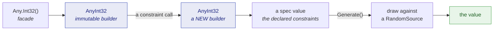
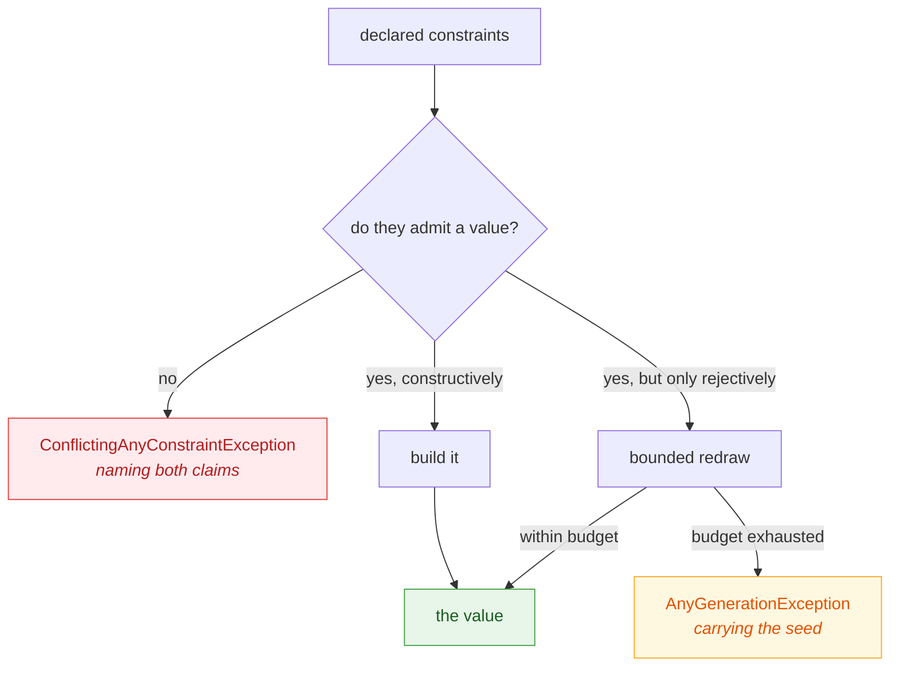

# Architecture

🌍 **Languages:**  
🇬🇧 English (this file) | 🇫🇷 [Français](./architecture.fr.md)

How the repository is laid out, what happens between `Any.Int32()` and a number, and where a change
of a given kind belongs. Written for someone about to modify the library, not to use it.

## The projects

| Project | Ships as | Targets | What it is |
| --- | --- | --- | --- |
| `JustDummies` | `JustDummies` | `netstandard2.0` + `net8.0` | the library, with the analyzers packed inside it |
| `JustDummies.Analyzers` | *inside* `JustDummies` | `netstandard2.0` | the 28 Roslyn rules, at `analyzers/dotnet/cs` |
| `JustDummies.Xunit` | `JustDummies.Xunit` | `netstandard2.0` | the xUnit v3 adapter — one attribute |
| `JustDummies.DiagnosticCatalog` | `JustDummies.DiagnosticCatalog` | `netstandard2.0` | the rule ids as compile-checked constants |
| `JustDummies.UnitTests` | — | — | named cases: messages, argument validation, conventions, regressions |
| `JustDummies.PropertyTests` | — | — | invariants that hold for every legal constraint argument |
| `JustDummies.Analyzers.UnitTests` | — | — | one suite per rule, over compiled snippets |
| `JustDummies.Xunit.UnitTests` | — | — | the adapter's lifecycle |
| `JustDummies.Documentation.UnitTests` | — | — | the documentation's own contracts |
| `tools/justdummies-check` | — | — | packaged-asset compatibility, deliberately outside the solution |

Two target frameworks, one reason: `netstandard2.0` is the floor that gives the library its reach —
down to .NET Framework 4.7.2, which CI exercises
([ADR-0007](./adr/0007-floor-the-library-on-net-framework-4-7-2.md)) — and `net8.0` carries the five
generators whose **types** do not exist below it: `DateOnly`, `TimeOnly`, `Int128`, `UInt128`,
`Half`. Anything net8-only lives behind the existing `#if NET8_0_OR_GREATER` branch, never in the
common surface.

## The one shape every generator has

`Any` is a `static partial class` split by family — `Any.Primitive.cs`, `Any.Collection.cs`,
`Any.Choice.cs`, `Any.Combine.cs`, `Any.Pattern.cs`, `Any.Uri.cs`, `Any.Reproducibility.cs`. It
holds no state; it is a set of doors.

Behind each door sits an `AnyXxx` builder, and every one of them is the same three-part machine:

1. **The builder is immutable.** Every constraint returns a new instance. This is the property the
   whole public contract rests on, and the reason two analyzers exist
   ([JD005](../for-users/analyzers/JD005.en.md), [JD006](../for-users/analyzers/JD006.en.md)).
2. **The declared constraints are carried as a value, never as the text they render to**
   ([ADR-0042](./adr/0042-carry-a-declared-constraint-as-a-value-object.md)). That is what
   `ConstraintCall` and `ConstraintClaim` are for, and it is why a conflict message can name *both*
   sides: the two claims are still objects when they meet.
3. **The spec types hold the narrowed domain**: `StringSpec`, `UriSpec`, `CollectionState`,
   `CountSpec`/`CountConstraints`, and the interval family — `OrdinalIntervalSpec`,
   `ContinuousIntervalSpec`, `DecimalIntervalSpec`, `WideIntervalSpec`. Discrete generation is
   unified in one ordinal space rather than reimplemented per type
   ([ADR-0032](./adr/0032-unify-discrete-generation-in-one-ordinal-space.md)), which is why a new
   integral type is usually a thin addition rather than a new algorithm.

A type marked `[ValueObject]` — `ConstraintClaim`, `ConstraintCall`, `Replay` — is held by a
reflection convention in `JustDummies.UnitTests` to a full value identity, and must be a `class`: a
`struct` would expose a zero-initialised instance bypassing every validating constructor
([ADR-0043](./adr/0043-declare-a-value-object-and-enforce-its-identity.md)).

## Where randomness comes from

`RandomSource` is an internal abstraction with one member that matters, `Current`, returning a
`SeededRandom`. Two implementations, and the difference between them is the whole reproducibility
story:

* **`AmbientRandomSource`** — the scope `Any.Reproducibly`, `Any.UseSeed` and the xUnit
  `[Reproducible]` attribute all pin. It flows with the execution context, which is what lets an
  adapter open it in a before-hook and close it in an after-hook
  ([ADR-0017](./adr/0017-open-the-ambient-seed-scope-to-adapters.md)).
* **An isolated source** — what `Any.WithSeed(seed)` hands out through an `AnyContext`. It is
  deliberately *not* ambient: values drawn from it ignore any enclosing scope.

A generator remembers which source it was built from through the internal `IHasRandomSource` seam,
so a derived generator — `.As(...)`, `.OrNull()`, a composed `Combine` — keeps drawing from the same
place as its operands. `AnyDerivation` is where that plumbing lives.

Draws are serialised on the source ([ADR-0021](./adr/0021-serialize-draws-on-a-random-source.md)),
which is what makes a *sequential* run replayable. Parallel work items inside one scope interleave
and are not; that is the honest limit, and diagnostic
[JD022](../for-users/analyzers/JD022.en.md) points at it.

## How a constraint becomes a value

Values are **built to satisfy** the declared specification, never drawn and filtered
([ADR-0033](./adr/0033-decide-a-constraint-surface-by-constructive-versus-rejective.md)). Three
outcomes, and every generator lands in one of them:

The rejective cases are few and named: exclusions on a continuous range
([ADR-0012](./adr/0012-meet-string-exclusions-with-a-bounded-redraw.md)), distinct collections past
the cardinality gate ([ADR-0004](./adr/0004-gate-distinct-collections-by-cardinality-else-bounded-draw.md)),
and regex matching ([ADR-0027](./adr/0027-guarantee-a-generated-regex-value-matches-by-bounded-redraw.md)).
`ICardinalityHint<T>` is how a generator answers "how many distinct values could you produce?" so the
gate can refuse before attempting.

Guards live where their bound does: `SizeGuard` refuses a producible size above one million
([ADR-0029](./adr/0029-let-a-size-maximum-cap-without-steering-the-draw.md)), `OrdinaryMagnitude`
keeps an unconstrained float or decimal within a magnitude of one million
([ADR-0031](./adr/0031-draw-arbitrary-numbers-within-an-ordinary-magnitude.md)), `CharacterPools`
owns the alphabets.

Exceptions are thrown through named factories rather than constructed inline
([ADR-0040](./adr/0040-throw-the-library-s-own-exceptions-through-named-factories.md)), and the
whole failure-reporting path is exempt from the null-guard convention — marked
`[BuiltOnTheFailurePath]` — because a guard that throws while reporting a failure hides the failure
([ADR-0041](./adr/0041-exempt-the-whole-failure-reporting-path-from-the-null-guard-convention.md)).

## The analyzers

`JustDummies.Analyzers` compiles against the **Roslyn floor** pinned in `Directory.Build.props`
(`RoslynFloorVersion`), because that version is the minimum host compiler able to load the analyzer
once it is packed into the library. A higher version makes it fail to load on older SDKs
([ADR-0001](./adr/0001-lock-the-analyzer-roslyn-floor.md)).

Each rule has five things that must move together — the `JDxxx` id, its message, its
`AnalyzerReleases.*.md` entry, its `for-users/analyzers/JDxxx.{en,fr}.md` pages, and the row in that
folder's README. Only the third is checked by a tool (RS2003).

## Where a change belongs

| If you are… | Go to |
| --- | --- |
| adding a constraint to an existing generator | the `AnyXxx` builder and its spec; add an example test and, if it holds for every argument, a property test |
| adding a generator for a new type | the matching `Any.*.cs` partial, a new `AnyXxx`, and the ordinal space if it is discrete |
| adding a net8-only generator | behind `#if NET8_0_OR_GREATER`, plus the `net8.0` PublicAPI baseline only |
| changing what a message says | the named exception factory — and the test that pins the wording |
| adding or retiring a rule | all five places listed above, together |
| changing the public surface | the `PublicAPI.Unshipped.txt` baseline of every affected target |
| changing CI | the workflow, plus its page under [`workflows/`](./workflows/README.md) |
| making a lasting decision | an [ADR](./adr/README.md), drafted `Proposed` |
| writing a test and unsure which suite | [Writing JustDummies tests](./WritingJustDummiesTests.en.md) |

Whatever you touch, the two properties that carry the product are worth protecting: **contradictory
constraints fail fast with a message naming both sides**, and **any sequential run replays from the
seed it reports**.

---

[← Maintainer documentation](./README.md)
