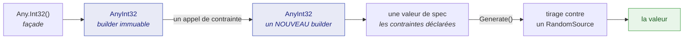
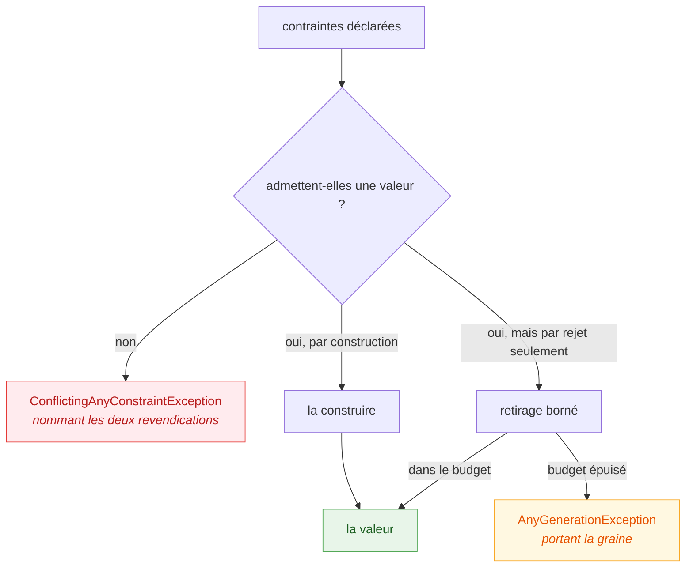

# Architecture

🌍 **Langues :**  
🇬🇧 [English](./architecture.en.md) | 🇫🇷 Français (ce fichier)

Comment le dépôt est agencé, ce qui se passe entre `Any.Int32()` et un nombre, et où va un changement
d'un type donné. Écrit pour qui s'apprête à modifier la bibliothèque, non à l'utiliser.

## Les projets

| Projet | Publié comme | Cibles | Ce que c'est |
| --- | --- | --- | --- |
| `JustDummies` | `JustDummies` | `netstandard2.0` + `net8.0` | la bibliothèque, analyzers empaquetés dedans |
| `JustDummies.Analyzers` | *dans* `JustDummies` | `netstandard2.0` | les 28 règles Roslyn, sous `analyzers/dotnet/cs` |
| `JustDummies.Xunit` | `JustDummies.Xunit` | `netstandard2.0` | l'adaptateur xUnit v3 — un attribut |
| `JustDummies.DiagnosticCatalog` | `JustDummies.DiagnosticCatalog` | `netstandard2.0` | les ids de règles en constantes vérifiées |
| `JustDummies.GenAny` | *dans* `JustDummies.Cli` | `netstandard2.0` | le moteur de scaffolding de `dum` — **aucune commande implémentée** |
| `JustDummies.Cli` | `JustDummies.Cli` (l'outil `dum`) | `net8.0` | la coquille : la ligne de commande de la §3, **rien derrière** |
| `JustDummies.UnitTests` | — | — | cas nommés : messages, validation d'arguments, conventions, régressions |
| `JustDummies.PropertyTests` | — | — | invariants valables pour tout argument de contrainte légal |
| `JustDummies.Analyzers.UnitTests` | — | — | une suite par règle, sur des extraits compilés |
| `JustDummies.Xunit.UnitTests` | — | — | le cycle de vie de l'adaptateur |
| `JustDummies.Documentation.UnitTests` | — | — | les contrats propres à la documentation |
| `JustDummies.GenAny.UnitTests` | — | — | le plancher du moteur et ses frontières |
| `JustDummies.Cli.UnitTests` | — | — | ce que l'outil répond en ligne de commande |
| `tools/justdummies-check` | — | — | compatibilité de l'asset empaqueté, volontairement hors solution |

Deux frameworks cibles, une raison : `netstandard2.0` est le plancher qui donne sa portée à la
bibliothèque — jusqu'à .NET Framework 4.7.2, que la CI exerce
([ADR-0007](./adr/0007-floor-the-library-on-net-framework-4-7-2.fr.md)) — et `net8.0` porte les cinq
générateurs dont les **types** n'existent pas en deçà : `DateOnly`, `TimeOnly`, `Int128`, `UInt128`,
`Half`. Tout ce qui est net8 seulement vit derrière la branche `#if NET8_0_OR_GREATER` existante,
jamais dans la surface commune.

## La forme unique qu'ont tous les générateurs

`Any` est une `static partial class` répartie par famille — `Any.Primitive.cs`, `Any.Collection.cs`,
`Any.Choice.cs`, `Any.Combine.cs`, `Any.Pattern.cs`, `Any.Uri.cs`, `Any.Reproducibility.cs`. Elle ne
porte aucun état ; c'est un ensemble de portes.

Derrière chaque porte se tient un builder `AnyXxx`, et tous sont la même machine en trois temps :

1. **Le builder est immuable.** Chaque contrainte renvoie une nouvelle instance. C'est la propriété
   sur laquelle repose tout le contrat public, et la raison d'être de deux analyzers
   ([JD005](../for-users/analyzers/JD005.fr.md), [JD006](../for-users/analyzers/JD006.fr.md)).
2. **Les contraintes déclarées sont portées comme des valeurs, jamais comme le texte qu'elles
   rendent** ([ADR-0042](./adr/0042-carry-a-declared-constraint-as-a-value-object.fr.md)). C'est le
   rôle de `ConstraintCall` et `ConstraintClaim`, et c'est pourquoi un message de conflit peut nommer
   *les deux* côtés : les deux revendications sont encore des objets quand elles se rencontrent.
3. **Les types de spec portent le domaine restreint** : `StringSpec`, `UriSpec`, `CollectionState`,
   `CountSpec`/`CountConstraints`, et la famille des intervalles — `OrdinalIntervalSpec`,
   `ContinuousIntervalSpec`, `DecimalIntervalSpec`, `WideIntervalSpec`. La génération discrète est
   unifiée dans un seul espace ordinal plutôt que réimplémentée par type
   ([ADR-0032](./adr/0032-unify-discrete-generation-in-one-ordinal-space.fr.md)), et c'est pourquoi
   un nouveau type intégral est le plus souvent un ajout mince plutôt qu'un nouvel algorithme.

Un type marqué `[ValueObject]` — `ConstraintClaim`, `ConstraintCall`, `Replay` — est tenu par une
convention par réflexion dans `JustDummies.UnitTests` à une identité de valeur complète, et doit être
une `class` : une `struct` exposerait une instance initialisée à zéro contournant tout constructeur
validant ([ADR-0043](./adr/0043-declare-a-value-object-and-enforce-its-identity.fr.md)).

## D'où vient le hasard

`RandomSource` est une abstraction interne dont un seul membre compte, `Current`, qui renvoie un
`SeededRandom`. Deux implémentations, et leur différence constitue toute l'histoire de la
reproductibilité :

* **`AmbientRandomSource`** — la portée qu'épinglent `Any.Reproducibly`, `Any.UseSeed` et l'attribut
  xUnit `[Reproducible]`. Elle suit le contexte d'exécution, ce qui permet à un adaptateur de
  l'ouvrir dans un crochet d'avant et de la fermer dans un crochet d'après
  ([ADR-0017](./adr/0017-open-the-ambient-seed-scope-to-adapters.fr.md)).
* **Une source isolée** — ce que `Any.WithSeed(seed)` distribue via un `AnyContext`. Elle n'est
  délibérément *pas* ambiante : les valeurs qui en sortent ignorent toute portée englobante.

Un générateur retient de quelle source il a été construit via la couture interne `IHasRandomSource` :
un générateur dérivé — `.As(...)`, `.OrNull()`, un `Combine` composé — continue donc de tirer au même
endroit que ses opérandes. `AnyDerivation` est l'endroit où vit cette plomberie.

Les tirages sont sérialisés sur la source
([ADR-0021](./adr/0021-serialize-draws-on-a-random-source.fr.md)), et c'est ce qui rend rejouable une
exécution *séquentielle*. Des tâches parallèles dans une même portée s'entrelacent et ne le sont
pas ; c'est la limite honnête, et le diagnostic [JD022](../for-users/analyzers/JD022.fr.md) la
signale.

## Comment une contrainte devient une valeur

Les valeurs sont **construites pour satisfaire** la spécification déclarée, jamais tirées puis
filtrées ([ADR-0033](./adr/0033-decide-a-constraint-surface-by-constructive-versus-rejective.fr.md)).
Trois issues, et tout générateur tombe dans l'une d'elles :

Les cas par rejet sont rares et nommés : exclusions sur un intervalle continu
([ADR-0012](./adr/0012-meet-string-exclusions-with-a-bounded-redraw.fr.md)), collections distinctes
au-delà du filtre de cardinalité
([ADR-0004](./adr/0004-gate-distinct-collections-by-cardinality-else-bounded-draw.fr.md)), et
correspondance d'expression régulière
([ADR-0027](./adr/0027-guarantee-a-generated-regex-value-matches-by-bounded-redraw.fr.md)).
`ICardinalityHint<T>` est la façon dont un générateur répond à « combien de valeurs distinctes
pourrais-tu produire ? », pour que le filtre refuse avant de tenter.

Les gardes vivent là où vit leur borne : `SizeGuard` refuse une taille à produire au-dessus d'un
million ([ADR-0029](./adr/0029-let-a-size-maximum-cap-without-steering-the-draw.fr.md)),
`OrdinaryMagnitude` maintient un flottant ou un décimal non contraint dans un ordre de grandeur d'un
million ([ADR-0031](./adr/0031-draw-arbitrary-numbers-within-an-ordinary-magnitude.fr.md)),
`CharacterPools` détient les alphabets.

Les exceptions sont levées via des fabriques nommées plutôt que construites sur place
([ADR-0040](./adr/0040-throw-the-library-s-own-exceptions-through-named-factories.fr.md)), et tout le
chemin de report d'échec est exempté de la convention de garde contre `null` — marqué
`[BuiltOnTheFailurePath]` — parce qu'une garde qui lève pendant le report d'un échec masque cet échec
([ADR-0041](./adr/0041-exempt-the-whole-failure-reporting-path-from-the-null-guard-convention.fr.md)).

## Les analyzers

`JustDummies.Analyzers` compile contre le **plancher Roslyn** épinglé dans `Directory.Build.props`
(`RoslynFloorVersion`), car cette version est le compilateur hôte minimum capable de charger
l'analyzer une fois empaqueté dans la bibliothèque. Une version plus élevée le fait échouer au
chargement sur les SDK plus anciens
([ADR-0001](./adr/0001-lock-the-analyzer-roslyn-floor.fr.md)).

Chaque règle possède cinq éléments qui doivent bouger ensemble — l'id `JDxxx`, son message, son
entrée `AnalyzerReleases.*.md`, ses pages `for-users/analyzers/JDxxx.{en,fr}.md`, et la ligne du
README de ce dossier. Seul le troisième est vérifié par un outil (RS2003).

## Où va un changement

| Si vous… | Allez vers |
| --- | --- |
| ajoutez une contrainte à un générateur existant | le builder `AnyXxx` et sa spec ; ajoutez un test par l'exemple et, si l'invariant vaut pour tout argument, un test de propriété |
| ajoutez un générateur pour un nouveau type | la partielle `Any.*.cs` correspondante, un nouveau `AnyXxx`, et l'espace ordinal s'il est discret |
| ajoutez un générateur net8 seulement | derrière `#if NET8_0_OR_GREATER`, plus la seule baseline PublicAPI `net8.0` |
| changez ce que dit un message | la fabrique d'exception nommée — et le test qui épingle la formulation |
| ajoutez ou retirez une règle | les cinq endroits listés ci-dessus, ensemble |
| changez la surface publique | la baseline `PublicAPI.Unshipped.txt` de chaque cible concernée |
| changez la CI | le workflow, plus sa page sous [`workflows/`](./workflows/README.fr.md) |
| prenez une décision durable | une [ADR](./adr/README.fr.md), rédigée en `Proposed` |
| écrivez un test sans savoir quelle suite | [Écrire les tests JustDummies](./WritingJustDummiesTests.fr.md) |

Quoi que vous touchiez, deux propriétés portent le produit et méritent d'être protégées : **des
contraintes contradictoires échouent immédiatement avec un message nommant les deux côtés**, et
**toute exécution séquentielle se rejoue depuis la graine qu'elle rapporte**.

---

[← Documentation mainteneur](./README.fr.md)
