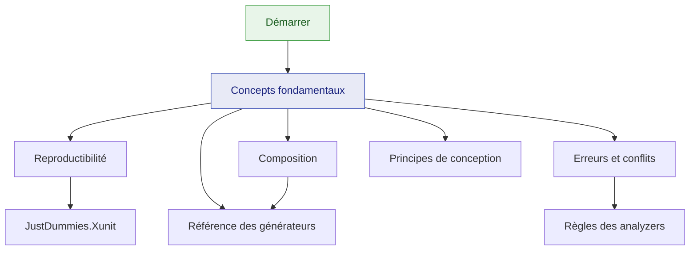

# Documentation JustDummies

🌍 **Langues :**  
🇬🇧 [English](./README.md) | 🇫🇷 Français (ce fichier)

JustDummies génère des valeurs de test **arbitraires mais valides**. Vous déclarez les invariants
qu'une valeur doit satisfaire, la bibliothèque en tire une qui les satisfait, et toute exécution
séquentielle se rejoue depuis la graine qu'elle rapporte.

## Commencer ici

**Nouveau sur la bibliothèque ?** → [**Démarrer**](./guides/getting-started.fr.md) — dix minutes
entre un projet de test vide et un test qui se lit mieux et se reproduit lui-même.

## Guides

Le parcours conceptuel. À lire dans l'ordre la première fois.

| Guide | Ce que vous en tirez |
| --- | --- |
| [Démarrer](./guides/getting-started.fr.md) | installation, votre premier dummy, un vrai test avant et après |
| [Concepts fondamentaux](./guides/core-concepts.fr.md) | recette contre valeur, immuabilité, et la règle d'or des contraintes |
| [Reproductibilité](./guides/reproducibility.fr.md) | graines, portées, rejeu d'un échec, l'attribut xUnit |
| [Composition](./guides/composition.fr.md) | des dummies pour vos propres types : `.As`, `Combine`, `OrNull` |
| [Erreurs et conflits](./guides/errors-and-conflicts.fr.md) | la hiérarchie d'exceptions, et comment lire un message de conflit |
| [Principes de conception](./guides/design-principles.fr.md) | ce que la bibliothèque refuse volontairement, et pourquoi |
| [FAQ](./guides/faq.fr.md) | réponses courtes aux questions les plus fréquentes |

## Référence des générateurs

De quoi chercher, organisé par le type dont vous avez besoin.

| Page | Couvre |
| --- | --- |
| [Index de toutes les fabriques](./generators/README.fr.md) | chaque appel `Any.*` associé à sa page |
| [Nombres](./generators/numbers.fr.md) | les quatorze types numériques, bornes, signe, multiples, échelle |
| [Chaînes et motifs](./generators/strings.fr.md) | longueur, alphabets, préfixes, et `Any.StringMatching` |
| [Dates et heures](./generators/dates-and-times.fr.md) | instants, durées, granularité, la dimension du décalage |
| [Collections](./generators/collections.fr.md) | tableaux, listes, séquences, ensembles, dictionnaires, distinction |
| [Énumérations et choix](./generators/enums-and-choices.fr.md) | énumérations, drapeaux, viviers, `ElementOf`, booléens |
| [Identifiants et URI](./generators/guids-and-uris.fr.md) | `Guid`, et les cinq familles d'URI |

## Paquets

| Page | Couvre |
| --- | --- |
| [Vue d'ensemble](./packages/README.fr.md) | lequel des trois paquets vous faut-il, et comment ils s'articulent |
| [`JustDummies`](./packages/justdummies.fr.md) | la bibliothèque et ses analyzers embarqués |
| [`JustDummies.Xunit`](./packages/justdummies-xunit.fr.md) | l'attribut `[Reproducible]` pour xUnit v3 |
| [`JustDummies.DiagnosticCatalog`](./packages/justdummies-diagnosticcatalog.fr.md) | les constantes de règles pour `[SuppressMessage]` |

## Règles des analyzers

28 règles sont embarquées dans la bibliothèque et s'exécutent dès votre prochaine compilation.
→ [**Index des règles**](./analyzers/README.fr.md), une page par diagnostic, en anglais et en
français. Le lien d'aide d'un diagnostic pointe directement vers sa page.

## Comment tout s'articule

## Parcours d'apprentissage

**Adopter la bibliothèque pour la première fois**

1. [Démarrer](./guides/getting-started.fr.md) — écrire un test avec des dummies
2. [Concepts fondamentaux](./guides/core-concepts.fr.md) — comprendre les recettes, et la règle d'or
3. [Reproductibilité](./guides/reproducibility.fr.md) — rendre les échecs rejouables avant d'en dépendre
4. [Référence des générateurs](./generators/README.fr.md) — chercher les types que vous utilisez vraiment

**L'introduire dans une suite existante**

1. [Paquets](./packages/README.fr.md) — décider quoi installer
2. [Composition](./guides/composition.fr.md) — construire d'abord les dummies de vos types métier ; le reste suit
3. [`JustDummies.Xunit`](./packages/justdummies-xunit.fr.md) — faire de la reproductibilité le défaut de la suite
4. [Erreurs et conflits](./guides/errors-and-conflicts.fr.md) — savoir ce que signifie un refus avant d'en rencontrer un
5. [Règles des analyzers](./analyzers/README.fr.md) — ajuster les sévérités à votre équipe

## Contribuer et sécurité

* [Guide de contribution](./CONTRIBUTING.fr.md) — conventions de commit, pull requests, règles du banc de test
* [Politique de sécurité](./SECURITY.fr.md) — comment signaler une vulnérabilité
* [Documentation mainteneur](../for-maintainers/README.fr.md) — décisions d'architecture, workflows, spécifications

---

[← README du dépôt](../../../README.fr.md)
