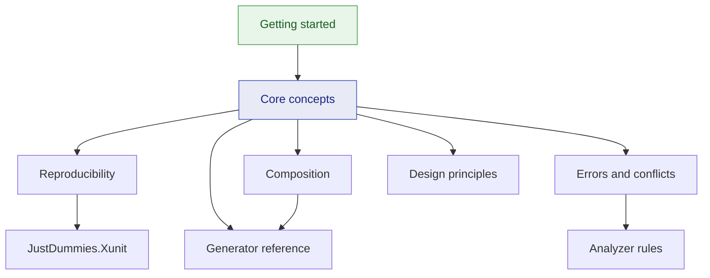

# JustDummies documentation

🌍 **Languages:**  
🇬🇧 English (this file) | 🇫🇷 [Français](./README.fr.md)

JustDummies generates **arbitrary yet valid** test values. You declare the invariants a value must
satisfy, the library draws one that satisfies them, and any sequential run replays from the seed it
reports.

## Start here

**New to the library?** → [**Getting started**](./guides/getting-started.en.md) — ten minutes from an
empty test project to a test that reads better and reproduces itself.

## Guides

The conceptual path. Read them in order the first time.

| Guide | What you get |
| --- | --- |
| [Getting started](./guides/getting-started.en.md) | install, your first dummy, a real test before and after |
| [Core concepts](./guides/core-concepts.en.md) | recipe versus value, immutability, and the golden rule of constraints |
| [Reproducibility](./guides/reproducibility.en.md) | seeds, scopes, replaying a failure, the xUnit attribute |
| [Composition](./guides/composition.en.md) | dummies for your own types: `.As`, `Combine`, `OrNull` |
| [Errors and conflicts](./guides/errors-and-conflicts.en.md) | the exception hierarchy, and how to read a conflict message |
| [Inspecting a pool](./guides/inspecting-a-pool.en.md) | which of your supplied values still draw, and which constraint took the rest |
| [Design principles](./guides/design-principles.en.md) | what the library refuses on purpose, and why |
| [FAQ](./guides/faq.en.md) | short answers to the questions that come up most |

## Generator reference

Look-up material, organised by the type you need.

| Page | Covers |
| --- | --- |
| [Index of every factory](./generators/README.md) | every `Any.*` call mapped to its page |
| [Numbers](./generators/numbers.en.md) | all fourteen numeric types, bounds, sign, multiples, scale |
| [Strings and patterns](./generators/strings.en.md) | length, alphabets, prefixes, and `Any.StringMatching` |
| [Dates and times](./generators/dates-and-times.en.md) | instants, durations, granularity, the offset dimension |
| [Collections](./generators/collections.en.md) | arrays, lists, sequences, sets, dictionaries, distinctness |
| [Enums and choices](./generators/enums-and-choices.en.md) | enumerations, flags, pools, `ElementOf`, booleans |
| [Identifiers and URIs](./generators/guids-and-uris.en.md) | `Guid`, and the five URI families |

## Packages

| Page | Covers |
| --- | --- |
| [Overview](./packages/README.md) | which of the four packages you need, and how they relate |
| [`JustDummies`](./packages/justdummies.en.md) | the library and its bundled analyzers |
| [`JustDummies.Xunit`](./packages/justdummies-xunit.en.md) | the xUnit v3 `[Reproducible]` attribute |
| [`JustDummies.DiagnosticCatalog`](./packages/justdummies-diagnosticcatalog.en.md) | rule constants for `[SuppressMessage]` |
| [`JustDummies.Cli`](./packages/justdummies-cli.en.md) | `dum`, the scaffolder: a generator for your own type, written once |

## Analyzer rules

29 rules ship inside the library and run on your next build.
→ [**Rule index**](./analyzers/README.md), one page per diagnostic, in English and French. A
diagnostic's help link points straight at its page.

## How it all fits together

## Learning paths

**Adopting the library for the first time**

1. [Getting started](./guides/getting-started.en.md) — write one test with dummies
2. [Core concepts](./guides/core-concepts.en.md) — understand recipes, and the golden rule
3. [Reproducibility](./guides/reproducibility.en.md) — make failures replayable before you rely on them
4. [Generator reference](./generators/README.md) — look up the types you actually use

**Introducing it into an existing suite**

1. [Packages](./packages/README.md) — decide what to install
2. [Composition](./guides/composition.en.md) — build dummies for your domain types first; the rest follows
3. [`JustDummies.Cli`](./packages/justdummies-cli.en.md) — scaffold those first generators instead of writing them by hand
4. [`JustDummies.Xunit`](./packages/justdummies-xunit.en.md) — make reproducibility the default for the suite
5. [Errors and conflicts](./guides/errors-and-conflicts.en.md) — know what a refusal means before you meet one
6. [Analyzer rules](./analyzers/README.md) — tune severities to your team

## Contributing and security

* [Contributing guide](../../../CONTRIBUTING.md) — commit conventions, pull requests, the test-bed rules
* [Security policy](../../../SECURITY.md) — how to report a vulnerability
* [Maintainer documentation](../for-maintainers/README.md) — architecture decisions, workflows, specifications

---

[← Repository README](../../../README.md)
