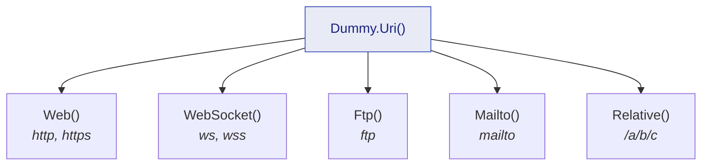

# Identifiers and URIs

🌍 **Languages:**  
🇬🇧 English (this file) | 🇫🇷 [Français](./guids-and-uris.fr.md)

Two generators for the two kinds of identifier that show up in almost every test: the opaque one, and
the structured one.

## Guids

```csharp
Guid id       = Dummy.Guid().Generate();
Guid nonEmpty = Dummy.Guid().NonEmpty().Generate();
Guid empty    = Dummy.Guid().Empty().Generate();        // always Guid.Empty
Guid notThis  = Dummy.Guid().DifferentFrom(Guid.Empty).Generate();
Guid oneOf    = Dummy.Guid().OneOf(Guid.Parse("11111111-1111-1111-1111-111111111111"),
                                 Guid.Parse("22222222-2222-2222-2222-222222222222")).Generate();
```

`Empty()` earns its place because `Guid.Empty` is a distinct case in most domains — the identifier
that has not been assigned yet. A test covering "what happens when the id is missing" reads better
as `Dummy.Guid().Empty()` than as the literal, because it stays in the same vocabulary as its
neighbours.

`NonEmpty()` is the mirror, and it is the one to reach for by default: an entity that exists has an
id, and letting the draw wander onto `Guid.Empty` would occasionally test a state your domain does
not have.

## URIs

`Dummy.Uri()` is the entry point, and unconstrained it spans the whole safe URI space — an absolute
web, WebSocket, FTP or mailto URI, or a relative reference:

```csharp
Uri anything = Dummy.Uri().Generate();
```

Narrowing to a **family** returns a builder exposing only the components that family actually has.
That is the design's point: an impossible combination — a port on a `mailto:`, a fragment on a
WebSocket URI — cannot even be written.



Every component is drawn from ASCII-unreserved characters and the URI is assembled directly, so a
value is valid by construction. Internationalized (IDN) hosts and the `file` scheme are deliberately
outside the unconstrained draw: neither round-trips identically across target frameworks, which would
break the determinism contract.

### Web URIs

```csharp
Uri page     = Dummy.Uri().Web().Generate();
Uri secure   = Dummy.Uri().Web().UsingHttps().WithHost("api.example.com").Generate();
Uri insecure = Dummy.Uri().Web().UsingHttp().Generate();
Uri deep     = Dummy.Uri().Web().WithPathSegments(3).Generate();          // /a/b/c
Uri bare     = Dummy.Uri().Web().WithoutPath().Generate();
Uri onAPort  = Dummy.Uri().Web().WithPort(8080).Generate();
Uri anyPort  = Dummy.Uri().Web().WithPort().Generate();                   // some port, unspecified
Uri queried  = Dummy.Uri().Web().WithQuery().WithFragment().Generate();
Uri withAuth = Dummy.Uri().Web().WithUserInfo("alice", "secret").Generate();
```

`WithPort()` without an argument asks for *a* port to be present without saying which — the
constraint you want when the code under test must cope with an explicit port but the number is
irrelevant. `WithUserInfo` has three forms: no argument, a user, or a user and a password.

### WebSocket URIs

```csharp
Uri socket = Dummy.Uri().WebSocket().Generate();                    // ws:// or wss://
Uri secure = Dummy.Uri().WebSocket().UsingWss().WithHost("live.example.com").Generate();
Uri plain  = Dummy.Uri().WebSocket().UsingWs().WithPathSegments(2).WithQuery().Generate();
```

A WebSocket URI has no fragment, so there is no `WithFragment` to call.

### FTP URIs

```csharp
Uri archive = Dummy.Uri().Ftp().Generate();
Uri hosted  = Dummy.Uri().Ftp().WithHost("files.example.com").WithPathSegments(2).Generate();
Uri account = Dummy.Uri().Ftp().WithUserInfo("alice").WithPort(2121).Generate();
Uri root    = Dummy.Uri().Ftp().WithoutPath().Generate();
```

### Mailto URIs

```csharp
Uri mail    = Dummy.Uri().Mailto().Generate();
Uri toAlice = Dummy.Uri().Mailto().WithLocalPart("alice").WithDomain("example.com").Generate();
Uri withCc  = Dummy.Uri().Mailto().WithHeaders().Generate();
```

A `mailto:` has no host, port or path — it has a local part, a domain and optional headers — and the
builder exposes exactly that.

### Relative references

```csharp
Uri relative = Dummy.Uri().Relative().Generate();
Uri rooted   = Dummy.Uri().Relative().Rooted().Generate();                    // /a/b/c
Uri deep     = Dummy.Uri().Relative().WithPathSegments(3).Generate();
Uri queried  = Dummy.Uri().Relative().WithPathSegments(1).WithQuery().WithFragment().Generate();
```

One combination is worth knowing: a relative reference with zero path segments and no query,
fragment or root is the **empty reference**. It is legal, and it is almost never what a test meant —
so it has its own diagnostic, [JD026](../analyzers/JD026.en.md). It is the one URI chain whose
failure lands at act time rather than at the arrange line, which is why the analyzer exists.

## Composing an identifier into your own type

Both generators feed `.As(...)` like any other:

```csharp
IDummy<Customer> anyCustomer = Dummy.Combine(
    Dummy.Guid().NonEmpty(),
    Dummy.String().Alpha().WithLengthBetween(3, 20),
    Dummy.Uri().Mailto().WithDomain("example.test"),
    (id, name, mail) => new Customer(id, name, mail.ToString()));

Customer customer = anyCustomer.Generate();
```

---

[← Generator reference](./README.md) · [Documentation index](../README.md)
