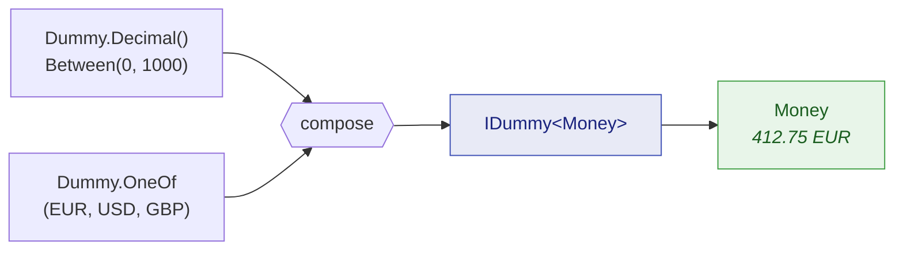

# Composition

🌍 **Languages:**  
🇬🇧 English (this file) | 🇫🇷 [Français](./composition.fr.md)

The built-in generators cover primitives. Your code is made of order references, money, customers
and aggregates. This page is about crossing that gap — turning constrained primitives into dummies
for **your** types, without ever producing a value your own constructor would reject.

## `.As(...)`: from a primitive to your type

A value object usually wraps a primitive behind a factory that validates. Constrain the primitive so
that it satisfies the factory, then hand the factory to `.As(...)`:

```csharp
// OrderReference.Create demands the "ORD-" prefix and a length of 12. The constraints
// are chosen so that every drawn string clears that bar — never so an assertion passes.
IDummy<OrderReference> anyReference = Dummy.String()
                                       .StartingWith("ORD-")
                                       .WithLength(12)
                                       .As(OrderReference.Create);

OrderReference reference = anyReference.Generate();
```

`.As(...)` takes an `IDummy<TSource>` and a `Func<TSource, TResult>` and returns an `IDummy<TResult>` —
a generator like any other, which can be stored, passed around, put in a collection, or made
nullable.

This is the supported route to a type with a stricter contract, and it has a property worth naming:
the factory is your real one. If the constraints are too loose, the factory throws, and you find out
immediately rather than shipping a dummy that could never exist in production.

## `Dummy.Combine`: several generators into one

When a type needs more than one input, `Dummy.Combine` draws from each generator and feeds a composer:



```csharp
IDummy<Money> anyMoney = Dummy.Combine(
    Dummy.Decimal().Between(0m, 1_000m).WithScale(2),
    Dummy.OneOf("EUR", "USD", "GBP"),
    Money.Create);

Money price = anyMoney.Generate();
```

The composer can be a method group, as above, or a lambda when the shape needs adjusting. Overloads
exist for two through eight generators.

Every operand must actually be **used** by the composer. An operand that is drawn and thrown away is
almost always a mistake — a parameter left unread after a refactor — so it is diagnostic
[JD027](../analyzers/JD027.en.md). When the draw really is deliberate, name the parameter `_` to say
so.

## When eight is not enough

The arity stops at eight on purpose
([ADR-0005](../../for-maintainers/adr/0005-cap-any-combine-at-arity-eight.md)). A type needing more
than eight independent inputs is a type that wants intermediate structure, and composing that
structure is both the workaround and the better design:

```csharp
// Compose the parts first...
IDummy<Money>          anyPrice     = Dummy.Combine(Dummy.Decimal().Between(0m, 1_000m).WithScale(2),
                                                Dummy.OneOf("EUR", "USD", "GBP"),
                                                Money.Create);
IDummy<OrderReference> anyReference = Dummy.String().StartingWith("ORD-").WithLength(12).As(OrderReference.Create);

// ...then combine the parts, not the primitives.
IDummy<string> anySummary = Dummy.Combine(
    anyReference,
    anyPrice,
    Dummy.Enum<OrderStatus>(),
    (orderRef, price, status) => $"{orderRef} — {price} — {status}");
```

A composed generator is an ordinary `IDummy<T>`, so it feeds another `Combine`, a collection, or an
`.As(...)` exactly like a primitive one does. That is what makes the cap a shape constraint rather
than a ceiling.

## `Dummy.PairOf` and `Dummy.TripleOf`

When all you want is the tuple, and no composer would add anything, two shorthands exist:

```csharp
IDummy<(int Quantity, decimal UnitPrice)> anyLine = Dummy.PairOf(
    Dummy.Int32().Between(1, 100),
    Dummy.Decimal().Between(0.01m, 500m).WithScale(2));

(int quantity, decimal unitPrice) = anyLine.Generate();

IDummy<(Guid, string, OrderStatus)> anyRow = Dummy.TripleOf(
    Dummy.Guid().NonEmpty(),
    Dummy.String().Alpha().WithLengthBetween(3, 20),
    Dummy.Enum<OrderStatus>());
```

## `.OrNull()`: optional values

An optional field deserves a dummy that is sometimes absent — otherwise the null branch is never
exercised. `.OrNull()` yields `null` about half the time and, otherwise, a value satisfying
everything declared upstream:

```csharp
// Value types: int?, DateTime?, Guid?, an enum...
int?      discount  = Dummy.Int32().Between(0, 100).OrNull().Generate();
DateTime? cancelled = Dummy.DateTime().Before(new DateTime(2030, 1, 1)).OrNull().Generate();

// Reference types: a nullable string, or a value object built through .As(...)
string?         note      = Dummy.String().Alpha().WithLengthBetween(1, 40).OrNull().Generate();
OrderReference? reference = Dummy.String().StartingWith("ORD-").WithLength(12)
                               .As(OrderReference.Create)
                               .OrNull()
                               .Generate();
```

There are two extension classes behind that single spelling — `NullableExtensions` for value types
and `NullableReferenceExtensions` for reference types — because one overload constrained to `struct`
and another to `class` would collide. You never pick between them: the compiler does, from the type
you are generating.

The null-versus-value decision draws from the same random context as the wrapped generator, so a
seeded run replays it exactly. A `null` draw does not consume a value from the wrapped generator.

## `.AsNullable()`: a nullable type, never an absent value

The opposite of `.OrNull()`, and the one you want far more often than the name suggests. A parameter
spelled `OrderStatus?` still has to be given a value; if the test does not care which, the dummy for it is
*not* sometimes-absent — an absent one exercises a branch the test never asked about.
`.AsNullable()` widens the type and leaves the values alone:

```csharp
OrderStatus? status = Dummy.Enum<OrderStatus>().AsNullable().Generate();   // never null
int?         units  = Dummy.Int32().Between(1, 10).AsNullable().Generate();
```

It matters most inside a **distinct** collection. `.As(value => (OrderStatus?)value)` would say the same
thing about the type and nothing at all about the domain, so a set could not tell how many distinct
values it had to draw from and would ask for more than exist:

```csharp
// The enum has a fixed number of members, so a set of them holds at most that many — and this knows it.
ISet<OrderStatus?> statuses = Dummy.SetOf(Dummy.Enum<OrderStatus>().AsNullable()).NonEmpty().Generate();
```

A generator scaffolded by `dum` writes `.AsNullable()` for every nullable value-type parameter, for
exactly that reason.

## Building a whole aggregate

Putting it together, here is a dummy for a record with three fields, none of which is a bare
primitive at the call site:

```csharp
IDummy<Customer> anyCustomer = Dummy.Combine(
    Dummy.Guid().NonEmpty(),
    Dummy.String().Alpha().WithLengthBetween(3, 20),
    Dummy.String().Alpha().InLowerCase().WithLengthBetween(3, 12),
    (id, name, localPart) => new Customer(id, name, $"{localPart}@example.test"));

Customer customer = anyCustomer.Generate();

// A generator is a recipe, so the same one produces a whole list of distinct customers.
List<Customer> customers = Dummy.ListOf(anyCustomer).WithCountBetween(2, 5).Generate();
```

Keep such a generator in a `static readonly` field of your test class and every test in the file
gets a valid customer for one call — with no shared mutable state, because generators are immutable.

---

[← Documentation index](../README.md)
