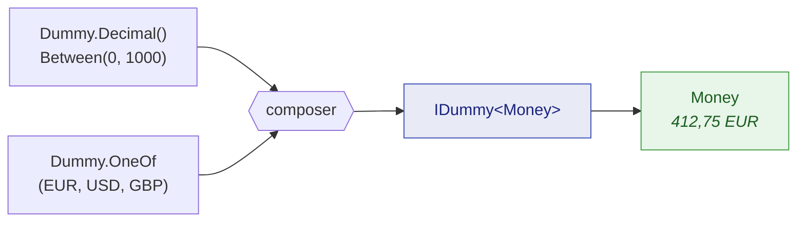

# Composition

🌍 **Langues :**  
🇬🇧 [English](./composition.en.md) | 🇫🇷 Français (ce fichier)

Les générateurs fournis couvrent les primitifs. Votre code, lui, est fait de références de commande,
de montants, de clients et d'agrégats. Cette page traite du franchissement de cet écart : transformer
des primitifs contraints en dummies pour **vos** types, sans jamais produire une valeur que votre
propre constructeur refuserait.

## `.As(...)` : d'un primitif vers votre type

Un objet-valeur enveloppe généralement un primitif derrière une fabrique qui valide. Contraignez le
primitif pour qu'il satisfasse la fabrique, puis passez la fabrique à `.As(...)` :

```csharp
// OrderReference.Create exige le préfixe « ORD- » et une longueur de 12. Les contraintes
// sont choisies pour que toute chaîne tirée franchisse cette barre — jamais pour faire
// passer une assertion.
IDummy<OrderReference> anyReference = Dummy.String()
                                       .StartingWith("ORD-")
                                       .WithLength(12)
                                       .As(OrderReference.Create);

OrderReference reference = anyReference.Generate();
```

`.As(...)` prend un `IDummy<TSource>` et un `Func<TSource, TResult>` et renvoie un `IDummy<TResult>` —
un générateur comme un autre, que l'on peut stocker, faire circuler, placer dans une collection ou
rendre nullable.

C'est la voie prévue vers un type au contrat plus strict, et elle a une propriété qui mérite d'être
nommée : la fabrique est la vraie. Si les contraintes sont trop lâches, la fabrique lève une
exception, et vous l'apprenez immédiatement au lieu de livrer un dummy qui n'aurait jamais pu
exister en production.

## `Dummy.Combine` : plusieurs générateurs en un seul

Quand un type demande plus d'une entrée, `Dummy.Combine` tire de chaque générateur et alimente un
composeur :



```csharp
IDummy<Money> anyMoney = Dummy.Combine(
    Dummy.Decimal().Between(0m, 1_000m).WithScale(2),
    Dummy.OneOf("EUR", "USD", "GBP"),
    Money.Create);

Money price = anyMoney.Generate();
```

Le composeur peut être un groupe de méthodes, comme ci-dessus, ou une lambda quand la forme demande
un ajustement. Des surcharges existent de deux à huit générateurs.

Chaque opérande doit être réellement **utilisé** par le composeur. Un opérande tiré puis jeté est
presque toujours une erreur — un paramètre resté non lu après un remaniement — d'où le diagnostic
[JD027](../analyzers/JD027.fr.md). Quand le tirage est vraiment délibéré, nommez le paramètre `_`
pour le dire.

## Quand huit ne suffit pas

L'arité s'arrête à huit volontairement
([ADR-0005](../../for-maintainers/adr/0005-cap-any-combine-at-arity-eight.fr.md)). Un type réclamant
plus de huit entrées indépendantes est un type qui appelle une structure intermédiaire, et composer
cette structure est à la fois le contournement et la meilleure conception :

```csharp
// Composez d'abord les parties...
IDummy<Money>          anyPrice     = Dummy.Combine(Dummy.Decimal().Between(0m, 1_000m).WithScale(2),
                                                Dummy.OneOf("EUR", "USD", "GBP"),
                                                Money.Create);
IDummy<OrderReference> anyReference = Dummy.String().StartingWith("ORD-").WithLength(12).As(OrderReference.Create);

// ...puis combinez les parties, non les primitifs.
IDummy<string> anySummary = Dummy.Combine(
    anyReference,
    anyPrice,
    Dummy.Enum<OrderStatus>(),
    (orderRef, price, status) => $"{orderRef} — {price} — {status}");
```

Un générateur composé est un `IDummy<T>` ordinaire : il alimente un autre `Combine`, une collection ou
un `.As(...)` exactement comme un générateur primitif. C'est ce qui fait du plafond une contrainte
de forme plutôt qu'une limite.

## `Dummy.PairOf` et `Dummy.TripleOf`

Quand seul le tuple vous intéresse et qu'aucun composeur n'apporterait quoi que ce soit, deux
raccourcis existent :

```csharp
IDummy<(int Quantity, decimal UnitPrice)> anyLine = Dummy.PairOf(
    Dummy.Int32().Between(1, 100),
    Dummy.Decimal().Between(0.01m, 500m).WithScale(2));

(int quantity, decimal unitPrice) = anyLine.Generate();

IDummy<(Guid, string, OrderStatus)> anyRow = Dummy.TripleOf(
    Dummy.Guid().NonEmpty(),
    Dummy.String().Alpha().WithLengthBetween(3, 20),
    Dummy.Enum<OrderStatus>());
```

## `.OrNull()` : les valeurs optionnelles

Un champ optionnel mérite un dummy parfois absent — sinon la branche nulle n'est jamais exercée.
`.OrNull()` produit `null` environ une fois sur deux et, sinon, une valeur satisfaisant tout ce qui
a été déclaré en amont :

```csharp
// Types valeur : int?, DateTime?, Guid?, une énumération...
int?      discount  = Dummy.Int32().Between(0, 100).OrNull().Generate();
DateTime? cancelled = Dummy.DateTime().Before(new DateTime(2030, 1, 1)).OrNull().Generate();

// Types référence : une chaîne nullable, ou un objet-valeur construit via .As(...)
string?         note      = Dummy.String().Alpha().WithLengthBetween(1, 40).OrNull().Generate();
OrderReference? reference = Dummy.String().StartingWith("ORD-").WithLength(12)
                               .As(OrderReference.Create)
                               .OrNull()
                               .Generate();
```

Deux classes d'extension se cachent derrière cette écriture unique — `NullableExtensions` pour les
types valeur et `NullableReferenceExtensions` pour les types référence — car une surcharge contrainte
à `struct` et une autre à `class` entreraient en collision. Vous ne choisissez jamais entre elles :
le compilateur le fait, d'après le type que vous générez.

La décision « null ou valeur » tire du même contexte aléatoire que le générateur enveloppé : une
exécution graînée la rejoue donc exactement. Un tirage `null` ne consomme pas de valeur du
générateur enveloppé.

## `.AsNullable()` : un type nullable, jamais une valeur absente

L'opposé de `.OrNull()`, et celui dont vous avez besoin bien plus souvent que le nom ne le laisse
croire. Un paramètre écrit `OrderStatus?` doit quand même recevoir une valeur ; si le test se moque
de laquelle, le dummy qui lui convient n'est *pas* parfois-absent — un dummy absent exerce une
branche que le test n'a jamais demandée. `.AsNullable()` élargit le type et laisse les valeurs
tranquilles :

```csharp
OrderStatus? status = Dummy.Enum<OrderStatus>().AsNullable().Generate();   // jamais null
int?         units  = Dummy.Int32().Between(1, 10).AsNullable().Generate();
```

Ça compte surtout à l'intérieur d'une collection **distincte**. `.As(value => (OrderStatus?)value)`
dirait la même chose du type et rien du tout du domaine : un ensemble ne saurait donc pas dans
combien de valeurs distinctes il a le droit de puiser, et en demanderait plus qu'il n'en existe.

```csharp
// L'énum a un nombre de membres fixe, donc un ensemble en contient au plus autant — et ceci le sait.
ISet<OrderStatus?> statuses = Dummy.SetOf(Dummy.Enum<OrderStatus>().AsNullable()).NonEmpty().Generate();
```

Un générateur scaffoldé par `dum` écrit `.AsNullable()` pour chaque paramètre nullable de type
valeur, exactement pour cette raison.

## Construire un agrégat entier

En rassemblant tout, voici un dummy pour un enregistrement à trois champs, dont aucun n'est un
primitif nu sur le site d'appel :

```csharp
IDummy<Customer> anyCustomer = Dummy.Combine(
    Dummy.Guid().NonEmpty(),
    Dummy.String().Alpha().WithLengthBetween(3, 20),
    Dummy.String().Alpha().InLowerCase().WithLengthBetween(3, 12),
    (id, name, localPart) => new Customer(id, name, $"{localPart}@example.test"));

Customer customer = anyCustomer.Generate();

// Un générateur est une recette : le même produit donc toute une liste de clients distincts.
List<Customer> customers = Dummy.ListOf(anyCustomer).WithCountBetween(2, 5).Generate();
```

Conservez un tel générateur dans un champ `static readonly` de votre classe de test et chaque test
du fichier obtient un client valide en un appel — sans état mutable partagé, puisque les générateurs
sont immuables.

---

[← Sommaire de la documentation](../README.fr.md)
