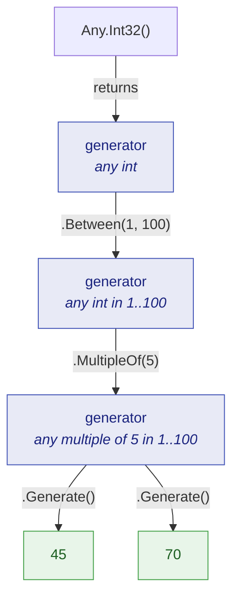
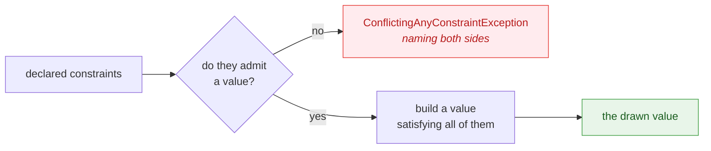

# Core concepts

🌍 **Languages:**  
🇬🇧 English (this file) | 🇫🇷 [Français](./core-concepts.fr.md)

Five ideas carry the whole library. Once they are in place, every generator in the reference reads
the same way, and the surprises stop.

All five stand on the definition [Getting started](./getting-started.en.md#what-is-a-dummy) opens
with — a dummy is a value a test needs and does not care about. Everything below is how the library
serves *that*; none of it makes a value a dummy that the test is about.

## A generator is a recipe, not a value

`Any.Int32()` does not give you a number. It gives you an `AnyInt32` — an object describing which
numbers would be acceptable. Nothing is drawn until `Generate()` is called, and every call draws
again:

```csharp
AnyInt32 anyQuantity = Any.Int32().Between(1, 100);

int first  = anyQuantity.Generate();
int second = anyQuantity.Generate();

// first and second are both in 1..100, and are usually different numbers.
```

This is the distinction the whole API rests on, and the reason the package ships analyzers: a recipe
and a value satisfy many of the same signatures, so the compiler cannot tell you when you have
confused them. Writing `$"{Any.Int32()}"` compiles perfectly and yields the string
`"JustDummies.AnyInt32"`. That is diagnostic [JD005](../analyzers/JD005.en.md), and it exists
precisely because nothing else would have caught it.



## Generators are immutable

A constraint never modifies the generator it is called on. It returns a **new** generator carrying
one more requirement, leaving the original exactly as it was:

```csharp
AnyString anyCode     = Any.String().Alpha().WithLength(8);
AnyString anyUpperCode = anyCode.InUpperCase();

string mixed = anyCode.Generate();      // 8 letters, any casing
string upper = anyUpperCode.Generate(); // 8 letters, upper case
```

Two consequences follow, and both are useful.

You can **share a generator freely** — put it in a `static readonly` field, pass it to a helper,
build ten variants from it — with no risk that one caller's constraint leaks into another's.

And a constraint whose result you throw away does nothing at all. This is a real mistake, easy to
make when a chain is split across lines, so it has its own diagnostic,
[JD006](../analyzers/JD006.en.md):

<!-- jd:allow=JD006 -->
```csharp
AnyString anyReference = Any.String().WithLength(12);

anyReference.StartingWith("ORD-"); // JD006: the result is discarded, so the prefix is lost

string reference = anyReference.Generate(); // 12 characters, no prefix
```

## `IAny<T>` is the seam everything composes on

Every generator implements `IAny<T>`, whose only member is `Generate()`. That single interface is
what lets generators be passed around, stored, and combined without the receiving code caring which
concrete type produced them:

```csharp
static List<T> ThreeOf<T>(IAny<T> generator) {
    return [generator.Generate(), generator.Generate(), generator.Generate()];
}

List<int>    quantities = ThreeOf(Any.Int32().Between(1, 100));
List<string> references = ThreeOf(Any.String().StartingWith("ORD-").WithLength(12));
```

It is also the currency of the composition API: `Any.ListOf`, `Any.Combine`, `.As(...)` and
`.OrNull()` all take and return `IAny<T>`. See [Composition](./composition.en.md) for what that
makes possible.

## A constraint states an invariant, never an assertion

This is the rule that decides whether a test using dummies is worth anything.

A constraint exists to describe **what the domain guarantees about the value**. It must never be
added to make an assertion pass. Consider a test for a rule that says a shipping fee is waived above
a threshold:

```csharp
// Anti-pattern: the constraint was chosen to make the assertion true.
decimal orderTotal = Any.Decimal().GreaterThan(100m).Generate();

Assert.Equal(0m, Shipping.FeeFor(orderTotal));
```

The test now proves nothing about the threshold — it proves the code agrees with the constraint the
test itself invented. Worse, the day the threshold moves to 200, this test still passes.

The reflex at this point is to loosen the constraint and compute the expectation from the drawn
value. Do not: it fails in the same way, and adds one of its own.

```csharp
// Still wrong, in a way that looks careful.
decimal orderTotal = Any.Decimal().Between(0m, 10_000m).WithScale(2).Generate();

decimal expected = orderTotal > 100m ? 0m : 4.90m;   // the rule, copied into the test

Assert.Equal(expected, Shipping.FeeFor(orderTotal));
```

That test asserts that `Shipping.FeeFor` agrees with a second copy of `Shipping.FeeFor` written in
the test body, so it too survives the threshold moving to 200. And `orderTotal` was never a dummy to
begin with: the fee is exactly what it decides, which makes it data taking part in what the test
verifies.

The honest version writes the boundary down, on both sides of it:

```csharp
// The threshold is what these tests are about, so it is spelled out rather than drawn.
Assert.Equal(0m,    Shipping.FeeFor(150m));   // above: waived
Assert.Equal(4.90m, Shipping.FeeFor(50m));    // below: charged
```

Notice what is *not* in that sample: a dummy. This test has none, and needs none — every value it
handles is one it is about. A dummy would appear the moment the fee had to be computed for a whole
order, whose reference and customer the rule never consults. **Reach for a dummy when a value must
be there and must not matter; when the value is the point, write it as a literal.**

Two tests rather than one is the shape to expect here: if you cannot express the test without
constraining the drawn value to the assertion's shape, the value is not a dummy, and what you want
is a literal on each side of the boundary.

## Values are built, not filtered

When a chain declares several constraints, JustDummies does **not** draw at random and retry until
something fits. It builds a value that satisfies the whole specification by construction. A run of
`Any.Int32().Between(1, 100).MultipleOf(7)` picks from the multiples of seven in that interval; it
does not roll dice hoping to land on one.

This is why contradictory constraints do not hang. They are refused, with a message naming **both**
sides of the conflict:

<!-- jd:allow=JD023 -->
```csharp
// Throws ConflictingAnyConstraintException — the message names both bounds.
int impossible = Any.Int32().GreaterThan(100).LessThan(10).Generate();
```

A handful of constraints cannot be honoured constructively — excluding values from a continuous
range, matching a regular expression, filling a collection with distinct elements. Those use a
**bounded** redraw: a fixed number of attempts, after which the draw fails loudly and reproducibly
rather than looping forever. [Errors and conflicts](./errors-and-conflicts.en.md) covers what that
looks like and how to react to it.



## What "arbitrary yet valid" does not promise

The library guarantees one thing precisely: a drawn value satisfies **every constraint declared at
the call site**. Being clear about what it does *not* promise is what keeps it predictable.

* **No distribution guarantee.** A draw is arbitrary, not uniform, not adversarial, and not tuned to
  find edge cases. If a specific boundary matters to your test, write it as a literal.
* **No shrinking.** This is not a property-based testing library. A failure is replayed exactly via
  its seed, not minimised to a smaller counter-example.
* **No whole-object graph.** There is no `Any.Object<T>()` that reflects over your type and fills it
  in. You compose the value yourself, which is what keeps the result valid by your rules rather than
  by a convention the library guessed.
* **One value per `Generate()`.** Coverage comes from running the suite often with varying seeds,
  not from one call exploring a space.

Those boundaries are deliberate and argued in [Design principles](./design-principles.en.md).

---

[← Documentation index](../README.md)
