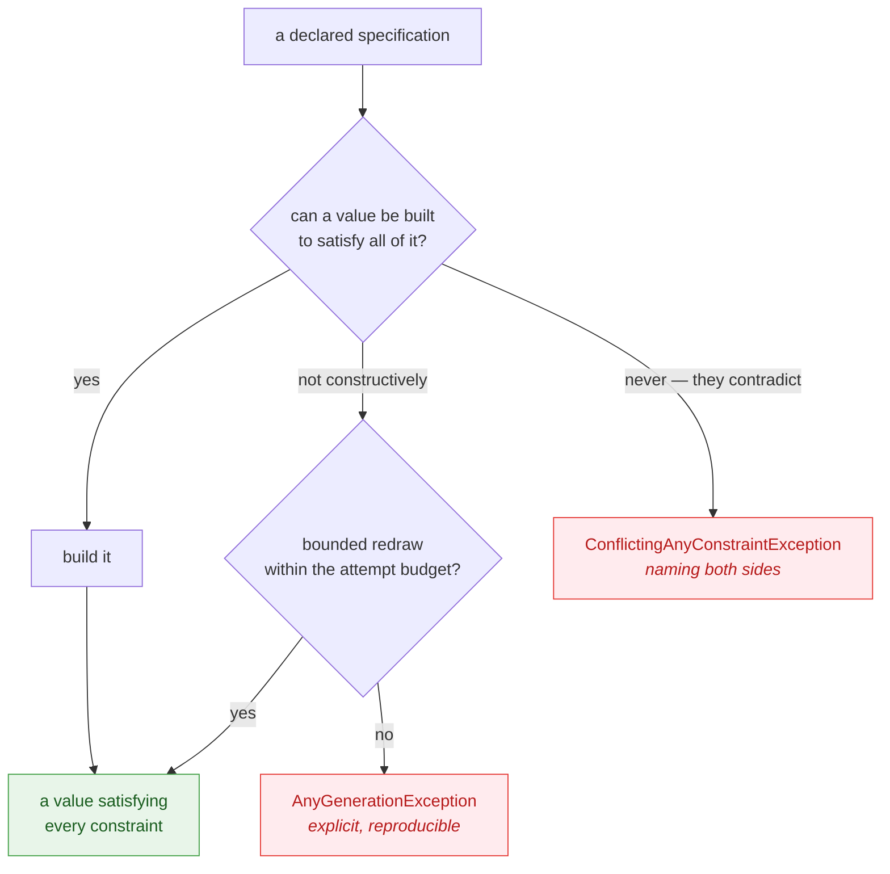

# Design principles

🌍 **Languages:**  
🇬🇧 English (this file) | 🇫🇷 [Français](./design-principles.fr.md)

Every library refuses something. Most do it by accident and apologise in the issue tracker.
JustDummies does it on purpose and writes the boundary down. This page explains where that boundary
runs, so you can decide whether it is the right library for you — and so its refusals stop looking
like gaps.

## "Just dummies" is a scope, not a slogan

The name is the specification. A dummy is **a value a test needs and does not care about**: it must
exist and be well-formed for the code to run, and its value never reaches the assertion and cannot
change the outcome. **Data that takes part in what the test is trying to verify is not a dummy** —
whether or not it appears in the assertion itself.

What the library guarantees about such a value is narrow and exact: it is arbitrary, and it is
**valid for the constraints declared at the call site**. It is not a statistically ideal draw, not a
universal generator, and not a constraint solver.

Both halves do work. Drop the guarantee and a dummy is unusable, because a value that violates the
domain fails for reasons the test never meant to explore. Drop the definition and the scope quietly
becomes something else: generate a value the test's outcome depends on and you have written a
property, which this library runs with a sample size of one and cannot defend. The
[getting-started guide](./getting-started.en.md#where-the-line-runs) shows exactly where that line
runs.

That is narrower than it could be, deliberately. The library's job is to make a test say what it
means and stay reproducible; anything beyond that competes for the same complexity budget and pays
for itself in surprises.

## Bound the ambition, never the correctness

The rule the whole design follows has two halves, and both matter
([ADR-0046](../../for-maintainers/adr/0046-bound-the-generators-ambition-never-its-correctness.md)):

* **Bounded ambition.** There is a limit to what the generator will *attempt*.
* **Unbounded correctness.** There is no limit on what it *guarantees* once it does attempt. A drawn
  value satisfies every constraint declared — always, with no "usually" attached.

So when a case falls outside what the library attempts, the answer is a clear refusal naming what
cannot be honoured. It is never a value produced by a mechanism nobody can reason about.



## The bounds, and why each one is there

| Bound | What it is | Why |
| --- | --- | --- |
| `Any.Combine` stops at eight | no overload takes nine generators | a type needing nine independent inputs wants intermediate structure; composing it is both the workaround and the better design ([ADR-0005](../../for-maintainers/adr/0005-cap-any-combine-at-arity-eight.md)) |
| `Any.StringMatching` parses a **regular** subset | non-regular constructs are refused by name | widening it would mean a regex-automaton dependency; a named refusal beats a hidden dependency ([ADR-0008](../../for-maintainers/adr/0008-generate-strings-from-a-home-grown-regular-subset.md)) |
| redraws are **bounded** | distinct collections, string exclusions and regex matching try a fixed number of times | a loop that might not end is worse than a failure that always explains itself ([ADR-0004](../../for-maintainers/adr/0004-gate-distinct-collections-by-cardinality-else-bounded-draw.md), [ADR-0027](../../for-maintainers/adr/0027-guarantee-a-generated-regex-value-matches-by-bounded-redraw.md)) |
| sizes stop at one million | a length or count above one million is refused | it is past the point where a test wanted a dummy and into the point where it wanted a load test ([ADR-0029](../../for-maintainers/adr/0029-let-a-size-maximum-cap-without-steering-the-draw.md)) |
| floating point stays ordinary | an unconstrained `double`, `float` or `decimal` is drawn within a magnitude of one million | draws spanning the type's full range produce values no domain has, and arithmetic nobody can assert on ([ADR-0031](../../for-maintainers/adr/0031-draw-arbitrary-numbers-within-an-ordinary-magnitude.md)) |

None of these is a temporary limitation waiting for someone to find the time. Each is a decision with
its reasoning recorded, and each can be revisited — by changing the decision, not by working around
it.

## A refusal is a feature

The alternative to refusing is guessing, and guessing is expensive in a place that is meant to be
boring. A generator that quietly returns *something* when the specification was impossible has moved
the failure from the arrange line, where it is obvious, to the assertion, where it looks like a
defect in your code.

So a contradiction is refused at the point it is declared, with a message naming **both** sides:

<!-- jd:allow=JD015 -->
```csharp
// Refused, and the message says which two constraints disagree.
string impossible = Any.String().StartingWith("ORDER-").WithLength(3).Generate();
```

That message is part of the product. A conflict that said only "no value is possible" would leave
you bisecting a chain by hand.

## What this means for you day to day

**You will occasionally have to do something by hand.** A pattern outside the regular subset, an
aggregate with fifteen fields, a value whose validity depends on another value drawn earlier. The
library gives you `IAny<T>`, `.As(...)` and `Combine`, and expects you to assemble the rest — which
keeps the result correct by *your* rules rather than by a convention it guessed.

**You will not have to debug the generator.** Every refusal names what it could not honour, every
draw satisfies what you declared, and every sequential run replays from the seed it reports. When a
test using dummies goes red, the defect is in the code under test.

**A missing feature is a decision you can read.** If something you expected is not there, the reason
is written down in the decision base rather than lost in a commit message — which is also what makes
it arguable. Open an issue and cite the ADR.

---

[← Documentation index](../README.md)
