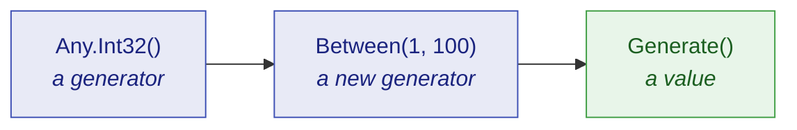

# Getting started

🌍 **Languages:**  
🇬🇧 English (this file) | 🇫🇷 [Français](./getting-started.fr.md)

Ten minutes from an empty test project to a test that reads better, hides less, and tells you
exactly how to reproduce itself when it goes red. No prior knowledge of dummy generators assumed.

## What is a dummy?

A **dummy** is a value a test needs but does not care about.

Every test has them. A test about discounts needs an order reference, but any order reference will
do. A test about shipping needs a customer name, but the name is irrelevant. Traditionally those
values get typed in by hand:

```csharp
string reference = "ORD-12345678";
int    quantity  = 3;
```

Hand-picked literals cause two specific problems.

The first is that they **lie about what matters**. A reader cannot tell whether `3` is essential to
the test or whether `7` would do just as well. Every literal looks equally load-bearing, so nobody
dares change one, and the test becomes harder to read than the code it covers.

The second is that they **only ever test one case**. `"ORD-12345678"` never has a leading zero,
never has repeated characters, and is always exactly that. A defect that needs a different shape of
input is a defect this test can never find.

JustDummies replaces the literal with a **declaration of what the value must satisfy**:

```csharp
string reference = Any.String().StartingWith("ORD-").WithLength(12).Generate();
int    quantity  = Any.Int32().Between(1, 100).Generate();
```

Now the test says what it means. The reference must start with `ORD-` and be twelve characters long
because *that is what an order reference is* — and everything else about it is free to vary.

## Install

```bash
dotnet add package JustDummies
```

That is the whole install. The package also carries its 33 analyzer rules inside it, so the guards on
correct usage start working on your next build with nothing further to configure.

## Your first dummy

```csharp
int      quantity  = Any.Int32().Between(1, 100).Generate();
string   name      = Any.String().Alpha().WithLengthBetween(3, 20).Generate();
Guid     id        = Any.Guid().NonEmpty().Generate();
DateTime orderedAt = Any.DateTime().Before(new DateTime(2030, 1, 1)).Generate();
```

Every line follows the same three-step shape, and it is worth naming the steps because the rest of
the library is just more of them.



1. **`Any.Int32()` opens a generator.** A generator is a *recipe* — a description of the values that
   would be acceptable. It is not a value, and no value has been drawn yet.
2. **`.Between(1, 100)` adds a constraint.** It does not modify the generator; it returns a **new**
   generator carrying one more requirement. The original is untouched.
3. **`.Generate()` draws a value.** This is the only step that produces something concrete, and it
   is the only step that involves randomness.

That second point is the one newcomers trip over, so it is worth seeing directly:

```csharp
AnyInt32 anyQuantity = Any.Int32().Between(1, 100);

// Adding a constraint returns a NEW generator; anyQuantity still means "1 to 100".
AnyInt32 anyEvenQuantity = anyQuantity.MultipleOf(2);

int     quantity = anyQuantity.Generate();     // 1..100, odd or even
int evenQuantity = anyEvenQuantity.Generate(); // 1..100, even
```

Because a generator is immutable, you can safely keep one in a field, hand it around, and build
variations from it without any of them interfering.

## A real test, before and after

Here is an ordinary test for a discount rule: taking 20 % off an order leaves four fifths of it. An
order cannot be built without a reference and a customer name, so the test has to supply both — and
the discount rule consults neither.

Written with literals, all four arguments look equally deliberate:

<!-- jd:declarations -->
```csharp
public sealed class OrderTests {

    [Fact]
    public void A_20_percent_discount_takes_a_fifth_off_the_order() {
        // Arrange
        Order order = new Order("ORD-12345678", "Alice", amount: 100m);

        // Act
        order.ApplyDiscount(20);

        // Assert
        Assert.Equal(80m, order.Total);
    }

}
```

Nothing in that test is about Alice, and nothing is about order `12345678` — but the code does not
say so. A reader has to open `Order` to find out whether the name is load-bearing, and the next
maintainer will hesitate before touching either literal.

Written with dummies, the test states which values it does not care about:

<!-- jd:declarations -->
```csharp
public sealed class OrderTests {

    [Fact]
    public void A_20_percent_discount_takes_a_fifth_off_the_order() {
        // Arrange
        // Reference and customer must be well-formed for an Order to exist.
        // Neither takes any part in the discount: that is what makes them dummies.
        string anyReference = Any.String().StartingWith("ORD-").WithLength(12).Generate();
        string anyCustomer  = Any.String().Alpha().WithLengthBetween(1, 50).Generate();

        Order order = new Order(anyReference, anyCustomer, amount: 100m);

        // Act
        order.ApplyDiscount(20);

        // Assert
        Assert.Equal(80m, order.Total);   // 100m and 20 are load-bearing — they stay literals
    }

}
```

Two conventions there are worth copying. Every drawn value is named **`anyXxxx`**, so a reader can
tell a dummy from a chosen value at a glance, without tracing where it came from. And the body is
split **Arrange / Act / Assert**, which is what makes the next observation impossible to miss.

Because look at where the `any` names appear: in the Arrange, and nowhere else. That is a dummy in
the strict sense — **a value the test needs and does not care about.** Neither draw reaches the
assertion, and no draw can change the outcome. Meanwhile `100m` and `20` stayed literals precisely
because the assertion *is* about them; generating them would have destroyed the test.

Which raises a fair question: if a dummy cannot change the outcome, why draw it at all? Because the
*test* not caring is not the same as *the code* not caring. `ApplyDiscount` has no business
consulting a customer name, and a draw that comes back empty, fifty characters long, or full of
punctuation is what demonstrates it does not. `"Alice"` can only ever demonstrate it for Alice. A
dummy is where a wrong dependency on an irrelevant value comes to light — and when one does, the
seed replays it exactly (see below).

Read the comment in that sample again, because it is the single most important habit in this
library:

> **A constraint states an invariant of the domain. It never restates what the test asserts.**

The reference is constrained to `ORD-` and twelve characters because *that is what an order
reference is*, not because `ApplyDiscount` would misbehave otherwise. If you ever find yourself
adding a constraint to make an assertion pass, the constraint is in the wrong place — and usually
the assertion has just found a real defect.

## Where the line runs

The habit is easier to keep once you have seen it broken. Here is the same rule, tested by
generating the amount and the percentage as well:

<!-- jd:declarations -->
```csharp
public sealed class OrderTests {

    [Fact]
    public void Applying_a_discount_keeps_the_total_between_zero_and_the_amount() {
        // Arrange
        string  anyReference  = Any.String().StartingWith("ORD-").WithLength(12).Generate();
        string  anyCustomer   = Any.String().Alpha().WithLengthBetween(1, 50).Generate();
        decimal anyAmount     = Any.Decimal().Between(0m, 10_000m).WithScale(2).Generate();
        int     anyPercentage = Any.Int32().Between(0, 100).Generate();

        Order order = new Order(anyReference, anyCustomer, anyAmount);

        // Act
        order.ApplyDiscount(anyPercentage);

        // Assert
        Assert.InRange(order.Total, 0m, anyAmount);   // ← an `any` name, in the assertion
    }

}
```

It compiles, it passes, and every constraint is an honest domain invariant. Two of those four draws
are still dummies. The other two are not, and the naming convention makes it visible without any
analysis: **`anyAmount` appears in the assertion.** This test cares a great deal which amount came
back — it has simply phrased its expectation relative to whatever that was.

> **If an `anyXxxx` reaches your assertion, it is not a dummy.** You have written a property, and
> JustDummies is running it with a sample size of one.

That is a real technique and nothing here stops you, but be clear about what you are holding. A
property-based library states such a rule and then *attacks* it: many cases per run, biased toward
the edges, shrinking any failure to a minimal counter-example. JustDummies draws one ordinary case
and moves on. So name the test for what a single run can show — keep *never* and *always* out of it
— and reach for [a property-based library](./faq.en.md#is-this-a-property-based-testing-library)
when you need the claim genuinely defended.

## Making a failure reproducible

A test that draws a different value every run is more powerful than one that does not — and it is
only acceptable if a failure can be replayed exactly. That is what `Any.Reproducibly` is for:

```csharp
Any.Reproducibly(() => {
    string anyReference = Any.String().StartingWith("ORD-").WithLength(12).Generate();
    string anyCustomer  = Any.String().Alpha().WithLengthBetween(1, 50).Generate();

    Order order = new Order(anyReference, anyCustomer, amount: 100m);

    order.ApplyDiscount(20);

    Assert.Equal(80m, order.Total);
});
```

While the body runs, every draw comes from one pinned seed. If the body throws, the seed is reported
before the failure propagates:

```text
[JustDummies] These arbitrary values were seeded with 1743029518. Reproduce this run with Any.Reproducibly(1743029518, ...).
```

Copy that number in front of the body. Nothing else moves — same test, one argument more — and the
exact run comes back, value for value:

```csharp
Any.Reproducibly(1743029518, () => {
    // the same draws as the run that failed
});
```

Debug against those exact values, fix the defect, then delete the seed so the test varies again.

If you use xUnit v3, the [`JustDummies.Xunit`](../packages/justdummies-xunit.en.md) package does
this for you with a `[Reproducible]` attribute, so no test body needs wrapping by hand.

## Where to go next

| If you want to… | Read |
| --- | --- |
| understand generators properly before going further | [Core concepts](./core-concepts.en.md) |
| replay a failing run, or pin a seed | [Reproducibility](./reproducibility.en.md) |
| build a dummy for one of *your* types | [Composition](./composition.en.md) |
| know what happens when constraints contradict | [Errors and conflicts](./errors-and-conflicts.en.md) |
| look up every constraint on a given type | [Generator reference](../generators/README.md) |
| know why the library refuses some things on purpose | [Design principles](./design-principles.en.md) |
| get a short answer to a specific question | [FAQ](./faq.en.md) |

---

[← Documentation index](../README.md)
