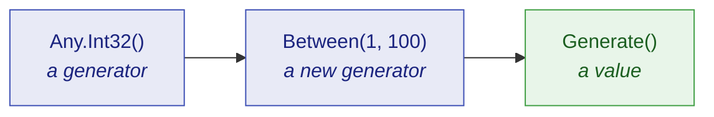

# Getting started

🌍 **Languages:**  
🇬🇧 English (this file) | 🇫🇷 [Français](./getting-started.fr.md)

In ten minutes, this page takes you from installing JustDummies to generating your first values to refactoring an existing test — so it makes visible what is arbitrary and what is not, and finally makes its intent explicit. No prior knowledge of dummy generators is required.

## What is a dummy?

A **dummy** is a value a test needs but does not care about.

Many tests have one.

For example, a discount test needs an order reference, but any one will do.

A shipping test needs a customer name, without that name playing any part in the behavior being verified.

That leaves deciding how to produce these values. The usual reflex is to hard-code them:

<!-- jd:declarations -->
```csharp
public sealed class OrderTests {

    [Fact]
    public void A_20_percent_discount_takes_a_fifth_off_the_order() {
        // Arrange
        OrderReference reference = OrderReference.Create("ORD-12345678");
        int            quantity  = 3;

        // ...
    }

}
```

A hand-picked literal has one specific problem: it **lies about what matters**. Reading the test, there's no way to tell whether `3` is essential or `7` would do just as well. Every literal looks equally deliberate, so nobody dares change one, and the test ends up hiding what it actually verifies.

JustDummies replaces the literal with a declaration of the constraints the value must satisfy to be valid:

<!-- jd:declarations -->
```csharp
public sealed class OrderTests {

    [Fact]
    public void A_20_percent_discount_takes_a_fifth_off_the_order() {
        // Arrange
        OrderReference anyReference = Any.String().StartingWith("ORD-").WithLength(12).As(OrderReference.Create).Generate();
        int            anyQuantity  = Any.Int32().Between(1, 100).Generate();

        // ...
    }

}
```

The test now states its intent.

## Install

```bash
dotnet add package JustDummies
```

That is the whole install. The package also carries its 33 analyzer rules inside it, so the guards on correct usage start working on your next build with nothing further to configure.

## Your first dummies

```csharp
int      anyQuantity  = Any.Int32().Between(1, 100).Generate();
string   anyName      = Any.String().Alpha().WithLengthBetween(3, 20).Generate();
Guid     anyId        = Any.Guid().NonEmpty().Generate();
DateTime anyOrderedAt = Any.DateTime().Before(new DateTime(2030, 1, 1)).Generate();
```

Every line follows the same three-step shape, and it is worth naming the steps because the rest of the library is just more of them.



1. **`Any.Int32()` opens a generator.** A generator is a *recipe* — a description of the values that would be acceptable. It is not a value, and no value has been drawn yet.
2. **`.Between(1, 100)` adds a constraint.** It does not modify the generator; it returns a **new** generator carrying one more requirement. The original is untouched.
3. **`.Generate()` draws a value.** This is the only step that produces something concrete, and it is the only step that involves randomness.

💡 **Good to know:** adding a constraint never modifies the original generator.

```csharp
AnyInt32 quantityGenerator = Any.Int32().Between(1, 100);

// Adding a constraint returns a NEW generator; quantityGenerator still means "1 to 100".
AnyInt32 evenQuantityGenerator = quantityGenerator.MultipleOf(2);

int anyQuantity     = quantityGenerator.Generate();     // 1..100, odd or even
int anyEvenQuantity = evenQuantityGenerator.Generate(); // 1..100, even
```

Because a generator is immutable, you can safely keep one in a field, hand it around, and build variations from it without any of them interfering.

## A real test, before and after

Here is an ordinary test for a discount rule: taking 20 % off an order leaves four fifths of it. An order cannot be built without a reference and a customer name, so the test has to supply both — and the discount rule consults neither.

Written with literals, all four arguments look equally deliberate:

<!-- jd:declarations -->
```csharp
public sealed class OrderTests {

    [Fact]
    public void A_20_percent_discount_takes_a_fifth_off_the_order() {
        // Arrange
        Order order = new Order(OrderReference.Create("ORD-12345678"), "Alice", amount: 100m);

        // Act
        order.ApplyDiscount(20);

        // Assert
        Assert.Equal(80m, order.Total);
    }

}
```

Nothing in that test is about Alice, and nothing is about order `12345678` — but the code does not say so. A reader has to open `Order` to find out whether the name is load-bearing, and the next maintainer will hesitate before touching either literal.

Written with dummies, the test states which values it does not care about:

<!-- jd:declarations -->
```csharp
public sealed class OrderTests {

    [Fact]
    public void A_20_percent_discount_takes_a_fifth_off_the_order() {
        // Arrange
        // Reference and customer must be well-formed for an Order to exist.
        // Neither takes any part in the discount: that is what makes them dummies.
        OrderReference anyReference    = Any.String().StartingWith("ORD-").WithLength(12).As(OrderReference.Create).Generate();
        string         anyCustomerName = Any.String().Alpha().WithLengthBetween(1, 50).Generate();

        Order order = new Order(anyReference, anyCustomerName, amount: 100m);

        // Act
        order.ApplyDiscount(20);

        // Assert
        Assert.Equal(80m, order.Total);   // 100m and 20 are load-bearing — they stay literals
    }

}
```

Of course, the goal is to factor that generation into named, reusable generators:

<!-- jd:declarations -->
```csharp
public sealed class OrderTests {

    [Fact]
    public void A_20_percent_discount_takes_a_fifth_off_the_order() {
        // Arrange
        OrderReference anyReference    = Any.OrderReference().Generate();
        string         anyCustomerName = Any.CustomerName().Generate();

        Order order = new Order(anyReference, anyCustomerName, amount: 100m);

        // Act
        order.ApplyDiscount(20);

        // Assert
        Assert.Equal(80m, order.Total);   // 100m and 20 are load-bearing — they stay literals
    }

}
```

<!-- jd:declarations -->
```csharp
public sealed class AnyOrderReference : IAny<OrderReference> {
    public OrderReference Generate() {
        return Any.String().StartingWith("ORD-").WithLength(12).As(OrderReference.Create).Generate();
    }
}

public sealed class AnyCustomerName : IAny<string> {
    public string Generate() {
        return Any.String().Alpha().WithLengthBetween(1, 50).Generate();
    }
}

public static class AnyEntry {
    extension(Any) {
        public static AnyOrderReference OrderReference() => new AnyOrderReference();
        public static AnyCustomerName   CustomerName()   => new AnyCustomerName();
    }
}
```

The test now states even more clearly what it cares about: `AnyOrderReference` and `AnyCustomerName` no longer need the original comment to signal that neither plays any part in the discount — the generator's name says so instead, with no constraint left to distract from it.

We use two conventions here to make the test more explicit:

- Every drawn value is named **`anyXxxx`**, so a reader can tell a dummy from a chosen value at a glance, without tracing where it came from.
- The test is split **Arrange / Act / Assert**, which is what makes the next observation impossible to miss.

Because look at where the `any` names appear: in the Arrange, and nowhere else. That is a dummy in the strict sense — **a value the test needs and does not care about.** Neither draw reaches the assertion, and no draw can change the outcome. Meanwhile `100m` and `20` stayed literals precisely because the assertion *is* about them; generating them would have destroyed the test.

Which raises a fair question: if a dummy cannot change the outcome, why draw it at all? Because the *test* not caring is not the same as *the code* not caring. `ApplyDiscount` has no business consulting a customer name, and a draw that comes back empty, fifty characters long, or full of punctuation is what demonstrates it does not. `"Alice"` can only ever demonstrate it for Alice. A dummy is where a wrong dependency on an irrelevant value comes to light — and when one does, the seed replays it exactly (see below).

Read the comment in the "with dummies" example above again: it is the single most important habit in this library.

> **A constraint states an invariant of the domain. It never restates what the test asserts.**

The reference is constrained to `ORD-` and twelve characters because *that is what an order reference is*, not because `ApplyDiscount` would misbehave otherwise. If you ever find yourself adding a constraint to make an assertion pass, the constraint is in the wrong place — and usually the assertion has just found a real defect.

## Careful not to misuse a dummy

Keeping a constraint as an invariant of the domain, never as a restatement of the assertion, is easier once you have seen it broken. Here is as simple an example as possible:

<!-- jd:declarations -->
```csharp
public sealed class StringTests {

    [Fact]
    public void Reversing_a_string_twice_gives_back_the_original() {
        // Arrange
        string anyText = Any.String().WithMaxLength(200).Generate();

        // Act
        string reversedOnce  = new string(anyText.Reverse().ToArray());
        string reversedTwice = new string(reversedOnce.Reverse().ToArray());

        // Assert
        Assert.Equal(anyText, reversedTwice);   // ← an `any` name, in the assertion
    }

}
```

It compiles, it passes — and yet `anyText` appears in the assertion, despite its name. This test does not check one specific text: it checks that a rule holds, whatever text was drawn.

> **If an `anyXxxx` reaches your assertion, it is not a dummy.** You have written a property (in the [property-based testing](https://fsharpforfunandprofit.com/pbt/) sense), and JustDummies is running it with a sample size of one.

> [!NOTE]
> Property-based testing is a whole different kind of test, not just a word used here loosely. It is a real technique and nothing here stops you, but JustDummies is not built for that: a property-based library states a rule and then *attacks* it — many cases per run, biased toward the edges, shrinking any failure to a minimal counter-example — where JustDummies draws one ordinary case and moves on. Reach for [a property-based library](./faq.en.md#is-this-a-property-based-testing-library) when you need the claim genuinely defended.

So name the test for what a single run can show — keep *never* and *always* out of it.

## Making a failure reproducible

A test whose drawn values change every run does not lie about their arbitrary nature — and it is only acceptable if a failure can be replayed exactly. That is what `Any.Reproducibly` is for:

```csharp
Any.Reproducibly(() => {
    // Arrange
    OrderReference anyReference    = Any.String().StartingWith("ORD-").WithLength(12).As(OrderReference.Create).Generate();
    string         anyCustomerName = Any.String().Alpha().WithLengthBetween(1, 50).Generate();

    Order order = new Order(anyReference, anyCustomerName, amount: 100m);

    // Act
    order.ApplyDiscount(20);

    // Assert
    Assert.Equal(80m, order.Total);
});
```

While the body runs, every draw comes from one pinned seed. If the body throws, the seed is reported before the failure propagates:

```text
[JustDummies] These arbitrary values were seeded with 1743029518. Reproduce this run with Any.Reproducibly(1743029518, ...).
```

Copy that number in front of the body. Nothing else moves — same test, one argument more — and the exact run comes back, value for value:

```csharp
Any.Reproducibly(1743029518, () => {
    // the same draws as the run that failed
});
```

Debug against those exact values, fix the defect, then delete the seed so the test varies again.

If you use xUnit v3, the [`JustDummies.Xunit`](../packages/justdummies-xunit.en.md) package does this for you with a `[Reproducible]` attribute, so no test body needs wrapping by hand:

<!-- jd:declarations -->
```csharp
public sealed class OrderTests {

    [Fact, Reproducible]
    public void A_20_percent_discount_takes_a_fifth_off_the_order() {
        // Arrange
        OrderReference anyReference    = Any.OrderReference().Generate();
        string         anyCustomerName = Any.CustomerName().Generate();

        Order order = new Order(anyReference, anyCustomerName, amount: 100m);

        // Act
        order.ApplyDiscount(20);

        // Assert
        Assert.Equal(80m, order.Total);
    }

}
```

If the test fails, the seed is reported in the test's output, the same way as with `Any.Reproducibly`; copy it onto the attribute to replay the exact run:

<!-- jd:declarations -->
```csharp
public sealed class OrderTests {

    [Fact, Reproducible(Seed = 1743029518)]
    public void A_20_percent_discount_takes_a_fifth_off_the_order() {
        // the same draws as the run that failed
    }

}
```

## Where to go next

| If you want to… | Read |
| --- | --- |
| understand generators properly before going further | [Core concepts](./core-concepts.en.md) |
| replay a failing run, or pin a seed | [Reproducibility](./reproducibility.en.md) |
| build a dummy for one of *your* types | [Composition](./composition.en.md) |
| know what happens when constraints contradict | [Errors and conflicts](./errors-and-conflicts.en.md) |
| look up every constraint on a given type | [Generator reference](../generators/README.md) |
| know why the library refuses some things on purpose | [Design principles](./design-principles.en.md) |
| get a short answer to a specific question | [FAQ](./faq.en.md) |

---

[← Documentation index](../README.md)
