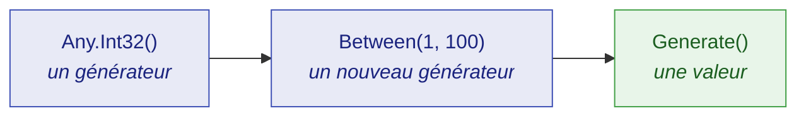

# Démarrer

🌍 **Langues :**  
🇬🇧 [English](./getting-started.en.md) | 🇫🇷 Français (ce fichier)

Cette page vous propose, en dix minutes, d'installer JustDummies, de générer vos premières valeurs, puis de refactorer un test existant pour qu'il rende visible ce qui est arbitraire et ce qui ne l'est pas, et qu'il rende enfin explicite son intention. Aucune connaissance préalable des générateurs de dummies n'est nécessaire.

## Qu'est-ce qu'un dummy ?

Un **dummy** est une valeur dont un test a besoin, mais dont il ne se soucie pas.

Beaucoup de tests en contiennent.

Par exemple, un test de remise a besoin d'une référence de commande, mais n'importe laquelle convient.

Un test de livraison a besoin d'un nom de client, sans que ce nom joue le moindre rôle dans le comportement vérifié.

Reste à décider comment produire ces valeurs. Le réflexe habituel est de les écrire en dur :

<!-- jd:declarations -->
```csharp
public sealed class OrderTests {

    [Fact]
    public void A_20_percent_discount_takes_a_fifth_off_the_order() {
        // Arrange
        OrderReference reference = OrderReference.Create("ORD-12345678");
        int            quantity  = 3;

        // ...
    }

}
```

Un littéral choisi à la main pose un problème précis : il **ment sur ce qui compte**. En lisant le test, impossible de dire si `3` est essentiel ou si `7` conviendrait tout aussi bien. Tous les littéraux ont l'air également choisis à dessein. Personne n'ose donc en modifier un, et le test finit par masquer ce qu'il vérifie réellement.

JustDummies remplace le littéral par une déclaration des contraintes que la valeur doit respecter pour être valide :

<!-- jd:declarations -->
```csharp
public sealed class OrderTests {

    [Fact]
    public void A_20_percent_discount_takes_a_fifth_off_the_order() {
        // Arrange
        OrderReference anyReference = Any.String().StartingWith("ORD-").WithLength(12).As(OrderReference.Create).Generate();
        int            anyQuantity  = Any.Int32().Between(1, 100).Generate();

        // ...
    }

}
```

Le test énonce maintenant son intention.

## Installation

```bash
dotnet add package JustDummies
```

C'est toute l'installation. Le paquet embarque aussi ses 33 règles d'analyzer, si bien que les garde-fous du bon usage se mettent à travailler dès la compilation suivante, sans rien configurer de plus.

## Vos premiers dummies

```csharp
int      anyQuantity  = Any.Int32().Between(1, 100).Generate();
string   anyName      = Any.String().Alpha().WithLengthBetween(3, 20).Generate();
Guid     anyId        = Any.Guid().NonEmpty().Generate();
DateTime anyOrderedAt = Any.DateTime().Before(new DateTime(2030, 1, 1)).Generate();
```

Chaque ligne suit la même structure en trois temps, et il vaut la peine de nommer ces temps : tout le reste de la bibliothèque n'en est qu'une déclinaison.



1. **`Any.Int32()` ouvre un générateur.** Un générateur est une *recette* — la description des valeurs qui seraient acceptables. Ce n'est pas une valeur, et aucune valeur n'a encore été tirée.
2. **`.Between(1, 100)` ajoute une contrainte.** Elle ne modifie pas le générateur : elle en renvoie un **nouveau**, porteur d'une exigence de plus. L'original reste intact.
3. **`.Generate()` tire une valeur.** C'est la seule étape qui produit quelque chose de concret, et la seule où intervient le hasard.

💡 **Bon à savoir :** une contrainte ajoutée ne modifie jamais le générateur d'origine.

```csharp
AnyInt32 quantityGenerator = Any.Int32().Between(1, 100);

// Ajouter une contrainte renvoie un NOUVEAU générateur ; quantityGenerator signifie toujours « 1 à 100 ».
AnyInt32 evenQuantityGenerator = quantityGenerator.MultipleOf(2);

int anyQuantity     = quantityGenerator.Generate();     // 1..100, pair ou impair
int anyEvenQuantity = evenQuantityGenerator.Generate(); // 1..100, pair
```

Parce qu'un générateur est immuable, on peut sans risque en conserver un dans un champ, le faire circuler, et en dériver des variantes sans qu'aucune n'interfère avec les autres.

## Un vrai test, avant et après

Voici un test ordinaire pour une règle de remise : retirer 20 % d'une commande en laisse les quatre cinquièmes. Une commande ne peut pas être construite sans référence ni nom de client — le test doit donc fournir les deux, et la règle de remise ne consulte ni l'un ni l'autre.

Avec des littéraux, les quatre arguments paraissent tout aussi délibérés :

<!-- jd:declarations -->
```csharp
public sealed class OrderTests {

    [Fact]
    public void A_20_percent_discount_takes_a_fifth_off_the_order() {
        // Arrange
        Order order = new Order(OrderReference.Create("ORD-12345678"), "Alice", amount: 100m);

        // Act
        order.ApplyDiscount(20);

        // Assert
        Assert.Equal(80m, order.Total);
    }

}
```

Rien dans ce test ne porte sur Alice, rien ne porte sur la commande `12345678` — mais le code ne le dit pas. Le lecteur doit ouvrir `Order` pour savoir si le nom est porteur, et le prochain mainteneur hésitera avant de toucher à l'un ou l'autre littéral.

Écrit avec des dummies, le test énonce les valeurs dont il ne se soucie pas :

<!-- jd:declarations -->
```csharp
public sealed class OrderTests {

    [Fact]
    public void A_20_percent_discount_takes_a_fifth_off_the_order() {
        // Arrange
        // Reference and customer must be well-formed for an Order to exist.
        // Neither takes any part in the discount: that is what makes them dummies.
        OrderReference anyReference    = Any.String().StartingWith("ORD-").WithLength(12).As(OrderReference.Create).Generate();
        string         anyCustomerName = Any.String().Alpha().WithLengthBetween(1, 50).Generate();

        Order order = new Order(anyReference, anyCustomerName, amount: 100m);

        // Act
        order.ApplyDiscount(20);

        // Assert
        Assert.Equal(80m, order.Total);   // 100m and 20 are load-bearing — they stay literals
    }

}
```

Bien sûr, le but est de factoriser cette génération dans des générateurs nommés et réutilisables :

<!-- jd:declarations -->
```csharp
public sealed class OrderTests {

    [Fact]
    public void A_20_percent_discount_takes_a_fifth_off_the_order() {
        // Arrange
        OrderReference anyReference    = Any.OrderReference().Generate();
        string         anyCustomerName = Any.CustomerName().Generate();

        Order order = new Order(anyReference, anyCustomerName, amount: 100m);

        // Act
        order.ApplyDiscount(20);

        // Assert
        Assert.Equal(80m, order.Total);   // 100m and 20 are load-bearing — they stay literals
    }

}
```

<!-- jd:declarations -->
```csharp
public sealed class AnyOrderReference : IAny<OrderReference> {
    public OrderReference Generate() {
        return Any.String().StartingWith("ORD-").WithLength(12).As(OrderReference.Create).Generate();
    }
}

public sealed class AnyCustomerName : IAny<string> {
    public string Generate() {
        return Any.String().Alpha().WithLengthBetween(1, 50).Generate();
    }
}

public static class AnyEntry {
    extension(Any) {
        public static AnyOrderReference OrderReference() => new AnyOrderReference();
        public static AnyCustomerName   CustomerName()   => new AnyCustomerName();
    }
}
```

Le test dit maintenant encore plus clairement ce qui compte pour lui : `AnyOrderReference` et `AnyCustomerName` n'ont plus besoin du commentaire d'origine pour signaler que ni l'un ni l'autre ne joue de rôle dans la remise — le nom du générateur le dit à la place du commentaire, sans qu'aucune contrainte ne vienne détourner l'attention.

Nous utilisons ici deux conventions afin de rendre le test plus explicite :

- Toute valeur tirée est nommée **`anyXxxx`**, si bien qu'un lecteur distingue un dummy d'une valeur choisie d'un coup d'œil, sans remonter à son origine.
- Le test est découpé en **Arrange / Act / Assert**, ce qui rend l'observation suivante impossible à manquer.

Car regardez où les noms en `any` apparaissent : dans l'Arrange, et nulle part ailleurs. Voilà un dummy au sens strict — **une valeur dont le test a besoin et dont il ne se soucie pas.** Aucun des deux tirages n'atteint l'assertion, et aucun tirage ne peut changer le résultat. Pendant ce temps, `100m` et `20` sont restés des littéraux précisément parce que l'assertion porte *sur eux* : les générer aurait détruit le test.

Ce qui soulève une question légitime : si un dummy ne peut pas changer le résultat, pourquoi le tirer ? Parce que le *test* qui s'en moque n'est pas la même chose que le *code* qui s'en moque. `ApplyDiscount` n'a rien à faire d'un nom de client, et c'est un tirage qui revient vide, long de cinquante caractères ou plein de ponctuation qui le démontre. `"Alice"` ne peut jamais le démontrer que pour Alice. Un dummy est l'endroit où une dépendance abusive à une valeur sans rapport se révèle — et quand cela arrive, la graine la rejoue exactement (voir plus bas).

Le commentaire de l'exemple « avec des dummies », plus haut, mérite une seconde lecture : c'est l'habitude la plus importante de toute la bibliothèque.

> **Une contrainte énonce un invariant du domaine. Elle ne redit jamais ce que le test affirme.**

La référence est contrainte à `ORD-` et douze caractères parce que *c'est ce qu'est une référence de commande*, et non parce qu'`ApplyDiscount` se comporterait mal sinon. Si vous vous surprenez à ajouter une contrainte pour faire passer une assertion, la contrainte n'est pas à sa place — et le plus souvent, l'assertion vient de trouver un vrai défaut.

## Attention à ne pas détourner un dummy de son rôle

Garder une contrainte comme un invariant du domaine, jamais comme une reformulation de l'assertion, se retient mieux quand on l'a vue enfreinte une fois. Voici un exemple aussi simple que possible :

<!-- jd:declarations -->
```csharp
public sealed class StringTests {

    [Fact]
    public void Reversing_a_string_twice_gives_back_the_original() {
        // Arrange
        string anyText = Any.String().WithMaxLength(200).Generate();

        // Act
        string reversedOnce  = new string(anyText.Reverse().ToArray());
        string reversedTwice = new string(reversedOnce.Reverse().ToArray());

        // Assert
        Assert.Equal(anyText, reversedTwice);   // ← an `any` name, in the assertion
    }

}
```

Cela compile, cela passe — et pourtant `anyText` apparaît dans l'assertion, malgré son nom. Ce test ne vérifie pas un texte précis : il vérifie qu'une règle tient, quel que soit le texte tiré.

> **Si un `anyXxxx` atteint votre assertion, ce n'est pas un dummy.** Vous avez écrit une propriété (au sens du [Property Based Testing](https://fr.wikipedia.org/wiki/Test_de_propri%C3%A9t%C3%A9)), et JustDummies l'exécute avec un échantillon de taille un.

> [!NOTE]
> Le Property Based Testing est un genre de test à part entière, pas juste un mot qu'on emploie ici par commodité. C'est une technique réelle et rien ici ne vous en empêche, mais JustDummies n'est pas faite pour ça : une bibliothèque à base de propriétés énonce une règle puis l'*attaque* — de nombreux cas par exécution, biaisés vers les bords, avec rétrécissement de tout échec jusqu'à un contre-exemple minimal — là où JustDummies tire un cas ordinaire et passe à la suite. Prenez [une bibliothèque à base de propriétés](./faq.fr.md#est-ce-une-bibliothèque-de-test-à-base-de-propriétés) quand vous avez besoin que la revendication soit réellement défendue.

Nommez donc le test d'après ce qu'une seule exécution peut montrer, sans y employer les mots « toujours » ou « jamais ».

## Rendre un échec reproductible

Un test dont les valeurs tirées changent à chaque exécution ne ment pas sur leur caractère arbitraire — et il n'est acceptable que si un échec peut être rejoué à l'identique. C'est le rôle de `Any.Reproducibly` :

```csharp
Any.Reproducibly(() => {
    // Arrange
    OrderReference anyReference    = Any.String().StartingWith("ORD-").WithLength(12).As(OrderReference.Create).Generate();
    string         anyCustomerName = Any.String().Alpha().WithLengthBetween(1, 50).Generate();

    Order order = new Order(anyReference, anyCustomerName, amount: 100m);

    // Act
    order.ApplyDiscount(20);

    // Assert
    Assert.Equal(80m, order.Total);
});
```

Pendant l'exécution du corps, tous les tirages proviennent d'une seule graine épinglée. Si le corps lève une exception, la graine est rapportée avant que l'échec ne se propage :

```text
[JustDummies] These arbitrary values were seeded with 1743029518. Reproduce this run with Any.Reproducibly(1743029518, ...).
```

Recopiez ce nombre devant le corps. Rien d'autre ne bouge — même test, un argument de plus — et l'exécution exacte revient, valeur pour valeur :

```csharp
Any.Reproducibly(1743029518, () => {
    // les mêmes tirages que l'exécution qui a échoué
});
```

Déboguez sur ces valeurs exactes, corrigez le défaut, puis supprimez la graine pour que le test recommence à varier.

Avec xUnit v3, le paquet [`JustDummies.Xunit`](../packages/justdummies-xunit.fr.md) fait cela pour vous via un attribut `[Reproducible]` : aucun corps de test n'a besoin d'être enveloppé à la main :

<!-- jd:declarations -->
```csharp
public sealed class OrderTests {

    [Fact, Reproducible]
    public void A_20_percent_discount_takes_a_fifth_off_the_order() {
        // Arrange
        OrderReference anyReference    = Any.OrderReference().Generate();
        string         anyCustomerName = Any.CustomerName().Generate();

        Order order = new Order(anyReference, anyCustomerName, amount: 100m);

        // Act
        order.ApplyDiscount(20);

        // Assert
        Assert.Equal(80m, order.Total);
    }

}
```

Si le test échoue, la graine est rapportée dans la sortie du test, comme pour `Any.Reproducibly` ; recopiez-la sur l'attribut pour rejouer l'exécution exacte :

<!-- jd:declarations -->
```csharp
public sealed class OrderTests {

    [Fact, Reproducible(Seed = 1743029518)]
    public void A_20_percent_discount_takes_a_fifth_off_the_order() {
        // les mêmes tirages que l'exécution qui a échoué
    }

}
```

## Et ensuite

| Pour… | Lire |
| --- | --- |
| bien comprendre les générateurs avant d'aller plus loin | [Concepts fondamentaux](./core-concepts.fr.md) |
| rejouer une exécution en échec, ou épingler une graine | [Reproductibilité](./reproducibility.fr.md) |
| construire un dummy pour *vos* types | [Composition](./composition.fr.md) |
| savoir ce qui arrive quand des contraintes se contredisent | [Erreurs et conflits](./errors-and-conflicts.fr.md) |
| retrouver toutes les contraintes d'un type donné | [Référence des générateurs](../generators/README.fr.md) |
| comprendre pourquoi la bibliothèque refuse certaines choses volontairement | [Principes de conception](./design-principles.fr.md) |
| obtenir une réponse courte à une question précise | [FAQ](./faq.fr.md) |

---

[← Sommaire de la documentation](../README.fr.md)
