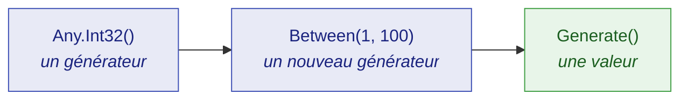

# Démarrer

🌍 **Langues :**  
🇬🇧 [English](./getting-started.en.md) | 🇫🇷 Français (ce fichier)

Dix minutes entre un projet de test vide et un test qui se lit mieux, dissimule moins, et indique
exactement comment le rejouer quand il passe au rouge. Aucune connaissance préalable des générateurs
de dummies n'est supposée.

## Qu'est-ce qu'un dummy ?

Un **dummy** est une valeur dont un test a besoin, mais dont il ne se soucie pas.

Tout test en contient. Un test sur les remises a besoin d'une référence de commande, mais n'importe
laquelle fera l'affaire. Un test sur la livraison a besoin d'un nom de client, mais ce nom n'a aucune
importance. Traditionnellement, ces valeurs sont saisies à la main :

```csharp
string reference = "ORD-12345678";
int    quantity  = 3;
```

Un littéral choisi à la main pose deux problèmes précis.

Le premier : il **ment sur ce qui compte**. Un lecteur ne peut pas savoir si `3` est essentiel au
test ou si `7` conviendrait tout aussi bien. Chaque littéral a l'air également porteur de sens,
personne n'ose donc en changer un, et le test devient plus difficile à lire que le code qu'il
couvre.

Le second : il **ne teste jamais qu'un seul cas**. `"ORD-12345678"` n'a jamais de zéro en tête,
jamais de caractère répété, et vaut toujours exactement cela. Un défaut qui demande une autre forme
d'entrée est un défaut que ce test ne trouvera jamais.

JustDummies remplace le littéral par une **déclaration de ce que la valeur doit satisfaire** :

```csharp
string reference = Any.String().StartingWith("ORD-").WithLength(12).Generate();
int    quantity  = Any.Int32().Between(1, 100).Generate();
```

Le test dit désormais ce qu'il veut dire. La référence doit commencer par `ORD-` et faire douze
caractères parce que *c'est cela, une référence de commande* — et tout le reste est libre de varier.

## Installation

```bash
dotnet add package JustDummies
```

C'est toute l'installation. Le paquet embarque aussi ses 33 règles d'analyzer, si bien que les garde-fous du
bon usage se mettent à travailler dès la compilation suivante, sans rien configurer de plus.

## Votre premier dummy

```csharp
int      quantity  = Any.Int32().Between(1, 100).Generate();
string   name      = Any.String().Alpha().WithLengthBetween(3, 20).Generate();
Guid     id        = Any.Guid().NonEmpty().Generate();
DateTime orderedAt = Any.DateTime().Before(new DateTime(2030, 1, 1)).Generate();
```

Chaque ligne suit la même structure en trois temps, et il vaut la peine de nommer ces temps : tout
le reste de la bibliothèque n'en est qu'une déclinaison.



1. **`Any.Int32()` ouvre un générateur.** Un générateur est une *recette* — la description des
   valeurs qui seraient acceptables. Ce n'est pas une valeur, et aucune valeur n'a encore été tirée.
2. **`.Between(1, 100)` ajoute une contrainte.** Elle ne modifie pas le générateur : elle en renvoie
   un **nouveau**, porteur d'une exigence de plus. L'original reste intact.
3. **`.Generate()` tire une valeur.** C'est la seule étape qui produit quelque chose de concret, et
   la seule où intervient le hasard.

Le deuxième point est celui sur lequel les débutants butent ; autant le voir directement :

```csharp
AnyInt32 anyQuantity = Any.Int32().Between(1, 100);

// Ajouter une contrainte renvoie un NOUVEAU générateur ; anyQuantity signifie toujours « 1 à 100 ».
AnyInt32 anyEvenQuantity = anyQuantity.MultipleOf(2);

int     quantity = anyQuantity.Generate();     // 1..100, pair ou impair
int evenQuantity = anyEvenQuantity.Generate(); // 1..100, pair
```

Parce qu'un générateur est immuable, on peut sans risque en conserver un dans un champ, le faire
circuler, et en dériver des variantes sans qu'aucune n'interfère avec les autres.

## Un vrai test, avant et après

Voici un test ordinaire pour une règle de remise : retirer 20 % d'une commande en laisse les quatre
cinquièmes. Une commande ne peut pas être construite sans référence ni nom de client — le test doit
donc fournir les deux, et la règle de remise ne consulte ni l'un ni l'autre.

Écrit avec des littéraux, les quatre arguments paraissent également délibérés :

<!-- jd:declarations -->
```csharp
public sealed class OrderTests {

    [Fact]
    public void A_20_percent_discount_takes_a_fifth_off_the_order() {
        // Arrange
        Order order = new Order("ORD-12345678", "Alice", amount: 100m);

        // Act
        order.ApplyDiscount(20);

        // Assert
        Assert.Equal(80m, order.Total);
    }

}
```

Rien dans ce test ne porte sur Alice, rien ne porte sur la commande `12345678` — mais le code ne le
dit pas. Le lecteur doit ouvrir `Order` pour savoir si le nom est porteur, et le prochain mainteneur
hésitera avant de toucher à l'un ou l'autre littéral.

Écrit avec des dummies, le test énonce les valeurs dont il ne se soucie pas :

<!-- jd:declarations -->
```csharp
public sealed class OrderTests {

    [Fact]
    public void A_20_percent_discount_takes_a_fifth_off_the_order() {
        // Arrange
        // Reference and customer must be well-formed for an Order to exist.
        // Neither takes any part in the discount: that is what makes them dummies.
        string anyReference = Any.String().StartingWith("ORD-").WithLength(12).Generate();
        string anyCustomer  = Any.String().Alpha().WithLengthBetween(1, 50).Generate();

        Order order = new Order(anyReference, anyCustomer, amount: 100m);

        // Act
        order.ApplyDiscount(20);

        // Assert
        Assert.Equal(80m, order.Total);   // 100m and 20 are load-bearing — they stay literals
    }

}
```

Deux conventions y méritent d'être copiées. Toute valeur tirée est nommée **`anyXxxx`**, si bien
qu'un lecteur distingue un dummy d'une valeur choisie d'un coup d'œil, sans remonter à son origine.
Et le corps est découpé en **Arrange / Act / Assert**, ce qui rend l'observation suivante impossible
à manquer.

Car regardez où les noms en `any` apparaissent : dans l'Arrange, et nulle part ailleurs. Voilà un
dummy au sens strict — **une valeur dont le test a besoin et dont il ne se soucie pas.** Aucun des
deux tirages n'atteint l'assertion, et aucun tirage ne peut changer le résultat. Pendant ce temps,
`100m` et `20` sont restés des littéraux précisément parce que l'assertion porte *sur eux* : les
générer aurait détruit le test.

Ce qui soulève une question légitime : si un dummy ne peut pas changer le résultat, pourquoi le
tirer ? Parce que le *test* qui s'en moque n'est pas la même chose que le *code* qui s'en moque.
`ApplyDiscount` n'a rien à faire d'un nom de client, et c'est un tirage qui revient vide, long de
cinquante caractères ou plein de ponctuation qui le démontre. `"Alice"` ne peut jamais le démontrer
que pour Alice. Un dummy est l'endroit où une dépendance abusive à une valeur sans rapport se
révèle — et quand cela arrive, la graine la rejoue exactement (voir plus bas).

Relisez le commentaire de cet exemple : c'est l'habitude la plus importante de toute la
bibliothèque.

> **Une contrainte énonce un invariant du domaine. Elle ne redit jamais ce que le test affirme.**

La référence est contrainte à `ORD-` et douze caractères parce que *c'est ce qu'est une référence de
commande*, et non parce qu'`ApplyDiscount` se comporterait mal sinon. Si vous vous surprenez à
ajouter une contrainte pour faire passer une assertion, la contrainte n'est pas à sa place — et le
plus souvent, l'assertion vient de trouver un vrai défaut.

## Où passe la ligne

L'habitude se tient mieux une fois qu'on l'a vue enfreinte. Voici la même règle, testée en générant
aussi le montant et le pourcentage :

<!-- jd:declarations -->
```csharp
public sealed class OrderTests {

    [Fact]
    public void Applying_a_discount_keeps_the_total_between_zero_and_the_amount() {
        // Arrange
        string  anyReference  = Any.String().StartingWith("ORD-").WithLength(12).Generate();
        string  anyCustomer   = Any.String().Alpha().WithLengthBetween(1, 50).Generate();
        decimal anyAmount     = Any.Decimal().Between(0m, 10_000m).WithScale(2).Generate();
        int     anyPercentage = Any.Int32().Between(0, 100).Generate();

        Order order = new Order(anyReference, anyCustomer, anyAmount);

        // Act
        order.ApplyDiscount(anyPercentage);

        // Assert
        Assert.InRange(order.Total, 0m, anyAmount);   // ← an `any` name, in the assertion
    }

}
```

Cela compile, cela passe, et chaque contrainte est un invariant honnête du domaine. Deux de ces
quatre tirages restent des dummies. Les deux autres non — et la convention de nommage le rend
visible sans la moindre analyse : **`anyAmount` apparaît dans l'assertion.** Ce test se soucie
beaucoup du montant qui est revenu ; il a simplement formulé son attente relativement à celui-ci.

> **Si un `anyXxxx` atteint votre assertion, ce n'est pas un dummy.** Vous avez écrit une propriété,
> et JustDummies l'exécute avec un échantillon de taille un.

C'est une technique réelle et rien ici ne vous en empêche, mais soyez au clair sur ce que vous tenez.
Une bibliothèque à base de propriétés énonce une telle règle puis l'*attaque* : de nombreux cas par
exécution, biaisés vers les bords, avec rétrécissement de tout échec jusqu'à un contre-exemple
minimal. JustDummies tire un cas ordinaire et passe à la suite. Nommez donc le test pour ce qu'une
seule exécution peut montrer — gardez *jamais* et *toujours* en dehors — et prenez [une bibliothèque
à base de propriétés](./faq.fr.md#est-ce-une-bibliothèque-de-test-à-base-de-propriétés) quand vous
avez besoin que la revendication soit réellement défendue.

## Rendre un échec reproductible

Un test qui tire une valeur différente à chaque exécution est plus puissant qu'un test qui n'en tire
qu'une — et il n'est acceptable que si un échec peut être rejoué à l'identique. C'est le rôle de
`Any.Reproducibly` :

```csharp
Any.Reproducibly(() => {
    string anyReference = Any.String().StartingWith("ORD-").WithLength(12).Generate();
    string anyCustomer  = Any.String().Alpha().WithLengthBetween(1, 50).Generate();

    Order order = new Order(anyReference, anyCustomer, amount: 100m);

    order.ApplyDiscount(20);

    Assert.Equal(80m, order.Total);
});
```

Pendant l'exécution du corps, tous les tirages proviennent d'une seule graine épinglée. Si le corps
lève une exception, la graine est rapportée avant que l'échec ne se propage :

```text
[JustDummies] These arbitrary values were seeded with 1743029518. Reproduce this run with Any.Reproducibly(1743029518, ...).
```

Recopiez ce nombre devant le corps. Rien d'autre ne bouge — même test, un argument de plus — et
l'exécution exacte revient, valeur pour valeur :

```csharp
Any.Reproducibly(1743029518, () => {
    // les mêmes tirages que l'exécution qui a échoué
});
```

Déboguez sur ces valeurs exactes, corrigez le défaut, puis supprimez la graine pour que le test
recommence à varier.

Avec xUnit v3, le paquet [`JustDummies.Xunit`](../packages/justdummies-xunit.fr.md) fait cela pour
vous via un attribut `[Reproducible]` : aucun corps de test n'a besoin d'être enveloppé à la main.

## Et ensuite

| Pour… | Lire |
| --- | --- |
| bien comprendre les générateurs avant d'aller plus loin | [Concepts fondamentaux](./core-concepts.fr.md) |
| rejouer une exécution en échec, ou épingler une graine | [Reproductibilité](./reproducibility.fr.md) |
| construire un dummy pour *vos* types | [Composition](./composition.fr.md) |
| savoir ce qui arrive quand des contraintes se contredisent | [Erreurs et conflits](./errors-and-conflicts.fr.md) |
| retrouver toutes les contraintes d'un type donné | [Référence des générateurs](../generators/README.fr.md) |
| comprendre pourquoi la bibliothèque refuse certaines choses volontairement | [Principes de conception](./design-principles.fr.md) |
| obtenir une réponse courte à une question précise | [FAQ](./faq.fr.md) |

---

[← Sommaire de la documentation](../README.fr.md)
