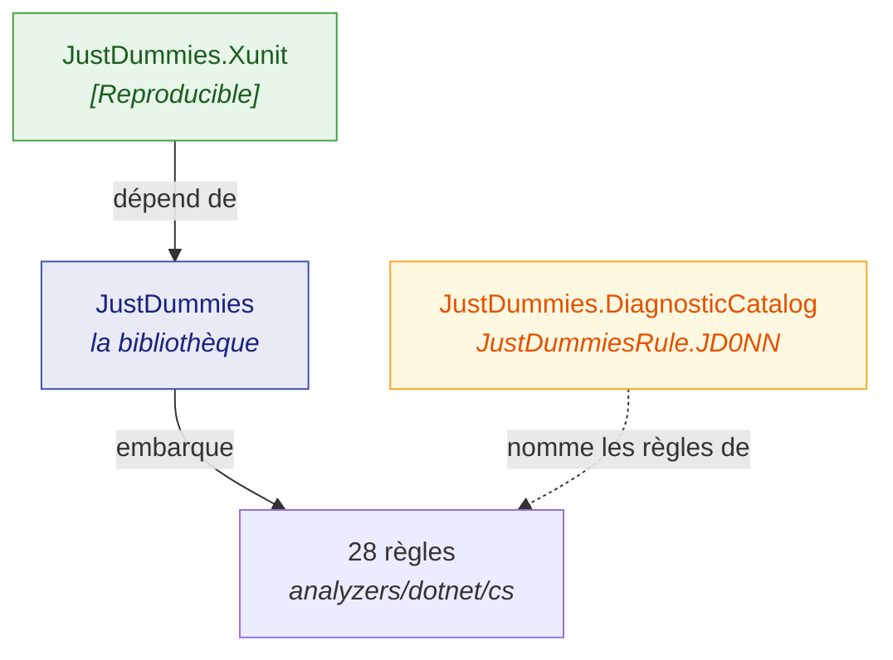

# Paquets

🌍 **Langues :**  
🇬🇧 [English](./README.md) | 🇫🇷 Français (ce fichier)

Trois paquets sont publiés depuis ce dépôt. La plupart des projets n'ont besoin que de l'un d'eux.

| Paquet | Ce que c'est | En ai-je besoin ? |
| --- | --- | --- |
| [`JustDummies`](./justdummies.fr.md) | la bibliothèque, avec ses 28 règles embarquées | **Oui** — c'est le produit |
| [`JustDummies.Xunit`](./justdummies-xunit.fr.md) | l'adaptateur xUnit v3 : `[Reproducible]` | Seulement avec xUnit v3, et seulement si vous voulez l'attribut |
| [`JustDummies.DiagnosticCatalog`](./justdummies-diagnosticcatalog.fr.md) | les règles `JD001`–`JD028` en constantes vérifiées par le compilateur | Seulement pour supprimer une règle sans littéral de chaîne |

## Comment ils s'articulent



`JustDummies` se suffit à lui-même : il ne prend aucune dépendance à l'exécution. Les analyzers
voyagent **à l'intérieur**, si bien qu'ajouter le paquet suffit à les obtenir.

`JustDummies.Xunit` dépend de la bibliothèque et de xUnit v3. `JustDummies.DiagnosticCatalog` est
autonome — il ne porte aucun générateur, seulement les identifiants de règles.

## Installation

```bash
dotnet add package JustDummies

# seulement avec xUnit v3
dotnet add package JustDummies.Xunit

# seulement pour nommer une règle dans un [SuppressMessage]
dotnet add package JustDummies.DiagnosticCatalog
```

Les versions présentes sur nuget.org ne sont pas répétées ici, car une copie de cette information est
périmée dès le lendemain d'une publication : consultez plutôt
[la fiche du paquet](https://www.nuget.org/packages/JustDummies).

## Frameworks cibles

Les trois ciblent **`netstandard2.0`**, ce qui leur donne leur portée.

`JustDummies` publie en plus un asset **`net8.0`** portant les générateurs des types qui n'existent
pas en deçà — `DateOnly`, `TimeOnly`, `Int128`, `UInt128` et `Half`. Un projet ciblant .NET 8 ou
au-delà résout cet asset et obtient ces fabriques ; un projet en deçà résout l'asset
`netstandard2.0`, où elles sont simplement absentes.

Le plancher .NET Framework supporté est **4.7.2**, et la CI y exécute les suites
([ADR-0007](../../for-maintainers/adr/0007-floor-the-library-on-net-framework-4-7-2.fr.md)).

## Une note sur la stabilité

La surface publique est déclarée dans `PublicAPI.Unshipped.txt` et non dans
`PublicAPI.Shipped.txt` : rien n'en est encore promis, et c'est une version stable qui la figera.

Le **contrat de graine** fait exception, et il est déjà promis : depuis `1.0.0-preview.1`, une graine
donnée tire les mêmes valeurs sur chaque version corrective et mineure d'une version majeure,
garanti par un golden master
([ADR-0049](../../for-maintainers/adr/0049-replay-a-seed-across-patch-and-minor-versions.fr.md)).

---

[← Sommaire de la documentation](../README.fr.md)
