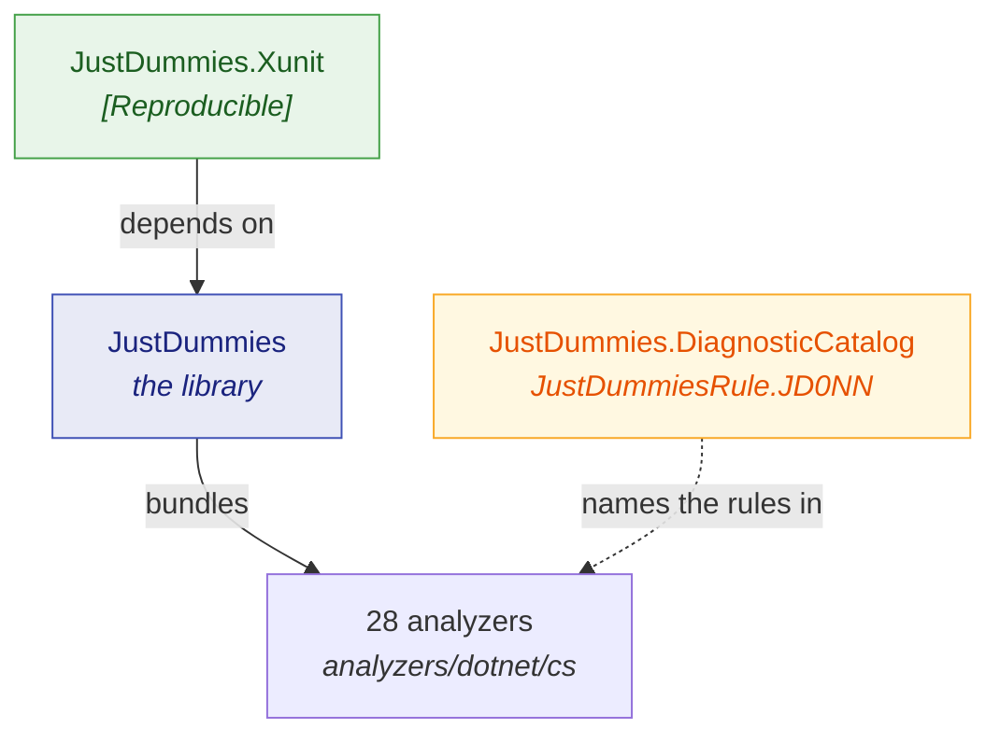

# Packages

🌍 **Languages:**  
🇬🇧 English (this file) | 🇫🇷 [Français](./README.fr.md)

Three packages ship from this repository. Most projects need exactly one of them.

| Package | What it is | Do I need it? |
| --- | --- | --- |
| [`JustDummies`](./justdummies.en.md) | the library, with its 28 analyzers bundled in | **Yes** — this is the product |
| [`JustDummies.Xunit`](./justdummies-xunit.en.md) | the xUnit v3 adapter: `[Reproducible]` | Only with xUnit v3, and only if you want the attribute |
| [`JustDummies.DiagnosticCatalog`](./justdummies-diagnosticcatalog.en.md) | the `JD001`–`JD028` rules as compile-checked constants | Only to suppress a rule without a string literal |

## How they relate



`JustDummies` stands alone: it takes no runtime dependency. The analyzers travel **inside** it, so
adding the package is all it takes to get them.

`JustDummies.Xunit` depends on the library and on xUnit v3. `JustDummies.DiagnosticCatalog` is
standalone — it carries no generator, only the rule identifiers.

## Installing

```bash
dotnet add package JustDummies

# only with xUnit v3
dotnet add package JustDummies.Xunit

# only to name a rule in a [SuppressMessage]
dotnet add package JustDummies.DiagnosticCatalog
```

Which versions are on nuget.org is not repeated here, because a copy of that goes stale the day after
a release: read [the package listing](https://www.nuget.org/packages/JustDummies) instead.

## Target frameworks

All three target **`netstandard2.0`**, which is what gives them their reach.

`JustDummies` additionally ships a **`net8.0`** asset carrying the generators for types that do not
exist downlevel — `DateOnly`, `TimeOnly`, `Int128`, `UInt128` and `Half`. A project targeting .NET 8
or later resolves that asset and gets those factories; a project below it resolves the
`netstandard2.0` asset, where they are simply absent.

The supported .NET Framework floor is **4.7.2**, and CI runs the suites on it
([ADR-0007](../../for-maintainers/adr/0007-floor-the-library-on-net-framework-4-7-2.md)).

## A note on stability

The public surface is declared in `PublicAPI.Unshipped.txt` rather than `PublicAPI.Shipped.txt`:
nothing about it is promised yet, and a stable release is what will freeze it.

The **seed contract** is the exception, and it is already promised: from `1.0.0-preview.1` a given
seed draws the same values across every patch and minor of a major version, enforced by a golden
master
([ADR-0049](../../for-maintainers/adr/0049-replay-a-seed-across-patch-and-minor-versions.md)).

---

[← Documentation index](../README.md)
